# PYRUS Backend Data Map

- Status: agent reference, 2026-06-04
- Audience: future agents first, humans second

This is the backend data diagnostic map. Its job is to make backend data wiring issues immediately traceable: what data the backend gets, why it gets it, where it goes, how it moves, how it is trusted, how it is exposed, how the frontend is allowed to use it, and where to fix defects.

All visual diagrams in this document are embedded inline. Do not move them to sidecar Markdown or SVG files; this file is intended to be the one-stop backend wiring spec.

If a production data issue cannot be traced with this map, update the map as part of the fix. The map is incomplete until every major data path has enough visible ownership, identity, source, freshness, actionability, failure reason, and validation context to diagnose wiring defects without rediscovering the system from scratch.

Read order:

1. Start with `App Data Routing Map` to see the app-wide data lanes.
2. Use `How To Diagnose A Data Wiring Issue` and `Data Wiring Diagnostic Map` to start from a visible bug and trace the owning client, API, hub, state/source, and repair rule.
3. Use `Data Use Rules`, `Use Rule Index`, and `Better-Use Guidance` before changing any API, stream, cache, generated client, trading, or signal path.
4. Use `Diagnostic Completeness Contract`, `Instant Diagnosis Matrix`, `Route Index`, `Data Inventory`, `Persistence Map`, and `Debug Waterfalls` when changing behavior or investigating a bug.

## Source Of Truth

- API app and routing: `artifacts/api-server/src/app.ts`, `artifacts/api-server/src/routes`, `artifacts/api-server/src/services`.
- Public contract and generated clients: `lib/api-spec/openapi.yaml`, `lib/api-client-react/src/generated`, `lib/api-zod/src/generated`.
- Storage schema: `lib/db/src/schema`.
- Broker bridge: `artifacts/ibkr-bridge/src/app.ts`, `artifacts/ibkr-bridge/src/service.ts`, `artifacts/ibkr-bridge/src/tws-provider.ts`.
- Backtest worker: `artifacts/backtest-worker/src/index.ts`.
- Main UI consumers: `artifacts/pyrus/src/features`.

## Backend Data Spec

This section is the comprehensive backend spec layer. The later maps and waterfalls are diagnostic views of the same system.

### Spec Overview Diagram

<div class="backend-data-diagram" markdown="0">
<svg xmlns="http://www.w3.org/2000/svg" width="1800" height="1180" viewBox="0 0 1800 1180" role="img" aria-labelledby="specOverview-title specOverview-desc">
  <title id="specOverview-title">PYRUS comprehensive backend data spec overview</title>
  <desc id="specOverview-desc">A layered backend data specification diagram showing source inputs, API middleware, route families, service domains, state stores, contracts, frontend consumers, diagnostics, and validation hooks.</desc>
  <defs>
    <marker id="specOverview-arrow" viewBox="0 0 10 10" refX="8" refY="5" markerWidth="7" markerHeight="7" orient="auto-start-reverse">
      <path d="M 0 0 L 10 5 L 0 10 z" fill="#334155"/>
    </marker>
    <style>
      .bg { fill: #f8fafc; }
      .title { font: 700 30px Inter, "Segoe UI", Arial, sans-serif; fill: #0f172a; }
      .subtitle { font: 400 15px Inter, "Segoe UI", Arial, sans-serif; fill: #475569; }
      .column-title { font: 700 13px Inter, "Segoe UI", Arial, sans-serif; fill: #334155; letter-spacing: .04em; }
      .box-title { font: 700 14px Inter, "Segoe UI", Arial, sans-serif; fill: #0f172a; }
      .box-text { font: 400 11.5px Inter, "Segoe UI", Arial, sans-serif; fill: #334155; }
      .panel { fill: #ffffff; stroke: #cbd5e1; stroke-width: 1.4; rx: 12; }
      .source { fill: #fff7ed; stroke: #c2410c; }
      .edge { fill: #fef3c7; stroke: #b45309; }
      .route { fill: #f5f3ff; stroke: #6d28d9; }
      .service { fill: #eff6ff; stroke: #1d4ed8; }
      .state { fill: #ecfdf5; stroke: #047857; }
      .client { fill: #fdf2f8; stroke: #be185d; }
      .guard { fill: #e0f2fe; stroke: #0369a1; }
      .flow { fill: none; stroke: #334155; stroke-width: 1.7; marker-end: url(#specOverview-arrow); }
      .soft { fill: none; stroke: #64748b; stroke-width: 1.4; stroke-dasharray: 6 6; marker-end: url(#specOverview-arrow); }
    </style>
  </defs>

  <rect class="bg" width="1800" height="1180"/>
  <text class="title" x="48" y="54">PYRUS Comprehensive Backend Data Spec</text>
  <text class="subtitle" x="48" y="82">Every data path must declare source, ingest owner, route family, service hub, state/cache, transport contract, frontend owner, diagnostics, and validation.</text>

  <text class="column-title" x="70" y="130">1 SOURCE / COMMAND</text>
  <text class="column-title" x="340" y="130">2 API EDGE</text>
  <text class="column-title" x="620" y="130">3 ROUTE FAMILY</text>
  <text class="column-title" x="920" y="130">4 SERVICE DOMAIN</text>
  <text class="column-title" x="1220" y="130">5 STATE / CONTRACT</text>
  <text class="column-title" x="1500" y="130">6 APP USE / PROOF</text>

  <rect class="panel" x="40" y="146" width="1720" height="824"/>

  <g id="main-flow">
    <rect class="source" x="64" y="178" width="210" height="86" rx="10"/>
    <text class="box-title" x="82" y="203">External providers</text>
    <text class="box-text" x="82" y="224">IBKR/TWS, Massive, FMP,</text>
    <text class="box-text" x="82" y="242">Nasdaq, local fixtures</text>

    <rect class="source" x="64" y="286" width="210" height="86" rx="10"/>
    <text class="box-title" x="82" y="311">Browser demand</text>
    <text class="box-text" x="82" y="332">orders, settings, charts,</text>
    <text class="box-text" x="82" y="350">reports, scans, backtests</text>

    <rect class="source" x="64" y="394" width="210" height="86" rx="10"/>
    <text class="box-title" x="82" y="419">Runtime workers</text>
    <text class="box-text" x="82" y="440">signal scans, backtests,</text>
    <text class="box-text" x="82" y="458">trade monitor, diagnostics</text>

    <rect class="edge" x="324" y="178" width="222" height="104" rx="10"/>
    <text class="box-title" x="342" y="203">Express /api edge</text>
    <text class="box-text" x="342" y="224">request logging, CORS, JSON,</text>
    <text class="box-text" x="342" y="242">route admission, problem JSON,</text>
    <text class="box-text" x="342" y="260">isolation report endpoints</text>

    <rect class="edge" x="324" y="306" width="222" height="104" rx="10"/>
    <text class="box-title" x="342" y="331">Bridge + stream edge</text>
    <text class="box-text" x="342" y="352">IBKR bridge REST/SSE,</text>
    <text class="box-text" x="342" y="370">API SSE readiness/status,</text>
    <text class="box-text" x="342" y="388">heartbeats, abort cleanup</text>

    <rect class="route" x="604" y="166" width="250" height="76" rx="10"/>
    <text class="box-title" x="622" y="191">platform routes</text>
    <text class="box-text" x="622" y="212">accounts, orders, quotes, bars,</text>
    <text class="box-text" x="622" y="230">options, streams, flow, GEX</text>

    <rect class="route" x="604" y="258" width="250" height="76" rx="10"/>
    <text class="box-title" x="622" y="283">automation + signals</text>
    <text class="box-text" x="622" y="304">Signal Monitor, Signal Options,</text>
    <text class="box-text" x="622" y="322">cockpit, STA, execution events</text>

    <rect class="route" x="604" y="350" width="250" height="76" rx="10"/>
    <text class="box-title" x="622" y="375">backtesting + charting</text>
    <text class="box-text" x="622" y="396">studies, runs, sweeps, Pine,</text>
    <text class="box-text" x="622" y="414">worker fetches, promotion drafts</text>

    <rect class="route" x="604" y="442" width="250" height="76" rx="10"/>
    <text class="box-title" x="622" y="467">settings + diagnostics</text>
    <text class="box-text" x="622" y="488">backend settings, preferences,</text>
    <text class="box-text" x="622" y="506">pressure, reports, thresholds</text>

    <rect class="route" x="604" y="534" width="250" height="76" rx="10"/>
    <text class="box-title" x="622" y="559">research + readiness</text>
    <text class="box-text" x="622" y="580">fundamentals, filings, status,</text>
    <text class="box-text" x="622" y="598">health, marketing snapshot</text>

    <rect class="service" x="906" y="166" width="260" height="76" rx="10"/>
    <text class="box-title" x="924" y="191">market + provider services</text>
    <text class="box-text" x="924" y="212">quotes, bars, chains, flow, GEX,</text>
    <text class="box-text" x="924" y="230">universe, admission, pacing</text>

    <rect class="service" x="906" y="258" width="260" height="76" rx="10"/>
    <text class="box-title" x="924" y="283">broker + trading services</text>
    <text class="box-text" x="924" y="304">accounts, positions, orders, fills,</text>
    <text class="box-text" x="924" y="322">shadow account, bridge reads</text>

    <rect class="service" x="906" y="350" width="260" height="76" rx="10"/>
    <text class="box-title" x="924" y="375">signal + algo services</text>
    <text class="box-text" x="924" y="396">profiles, matrix cells, candidates,</text>
    <text class="box-text" x="924" y="414">contract selection, workers</text>

    <rect class="service" x="906" y="442" width="260" height="76" rx="10"/>
    <text class="box-title" x="924" y="467">backtest + settings services</text>
    <text class="box-text" x="924" y="488">jobs, datasets, runs, Pine scripts,</text>
    <text class="box-text" x="924" y="506">watchlists, user preferences</text>

    <rect class="service" x="906" y="534" width="260" height="76" rx="10"/>
    <text class="box-title" x="924" y="559">diagnostics + readiness</text>
    <text class="box-text" x="924" y="580">request metrics, pressure, storage,</text>
    <text class="box-text" x="924" y="598">runtime flight recorder</text>

    <rect class="state" x="1210" y="166" width="250" height="76" rx="10"/>
    <text class="box-title" x="1228" y="191">Postgres / Drizzle</text>
    <text class="box-text" x="1228" y="212">broker, trading, market-data,</text>
    <text class="box-text" x="1228" y="230">signals, automation, backtests</text>

    <rect class="state" x="1210" y="258" width="250" height="76" rx="10"/>
    <text class="box-title" x="1228" y="283">Runtime caches</text>
    <text class="box-text" x="1228" y="304">route cache, stream cache, inflight,</text>
    <text class="box-text" x="1228" y="322">backoff, source snapshots</text>

    <rect class="state" x="1210" y="350" width="250" height="76" rx="10"/>
    <text class="box-title" x="1228" y="375">OpenAPI + generated clients</text>
    <text class="box-text" x="1228" y="396">api-zod validation, React Query,</text>
    <text class="box-text" x="1228" y="414">REST shape source of truth</text>

    <rect class="state" x="1210" y="442" width="250" height="76" rx="10"/>
    <text class="box-title" x="1228" y="467">Local/fallback state</text>
    <text class="box-text" x="1228" y="488">backend settings file, Pine seeds,</text>
    <text class="box-text" x="1228" y="506">remote desktop registrations</text>

    <rect class="state" x="1210" y="534" width="250" height="76" rx="10"/>
    <text class="box-title" x="1228" y="559">Diagnostics state</text>
    <text class="box-text" x="1228" y="580">snapshots, events, thresholds,</text>
    <text class="box-text" x="1228" y="598">request metrics, pressure drivers</text>

    <rect class="client" x="1500" y="166" width="220" height="76" rx="10"/>
    <text class="box-title" x="1518" y="191">Platform app surfaces</text>
    <text class="box-text" x="1518" y="212">header, watchlists, account,</text>
    <text class="box-text" x="1518" y="230">trade, charts, flow/GEX</text>

    <rect class="client" x="1500" y="258" width="220" height="76" rx="10"/>
    <text class="box-title" x="1518" y="283">Signals + Algo/STA</text>
    <text class="box-text" x="1518" y="304">signals matrix, STA table,</text>
    <text class="box-text" x="1518" y="322">cockpit, drilldowns</text>

    <rect class="client" x="1500" y="350" width="220" height="76" rx="10"/>
    <text class="box-title" x="1518" y="375">Backtesting + research</text>
    <text class="box-text" x="1518" y="396">studies, chart panels, ticker,</text>
    <text class="box-text" x="1518" y="414">research, promotion drafts</text>

    <rect class="client" x="1500" y="442" width="220" height="76" rx="10"/>
    <text class="box-title" x="1518" y="467">Settings + diagnostics</text>
    <text class="box-text" x="1518" y="488">readiness, pressure footer,</text>
    <text class="box-text" x="1518" y="506">thresholds, QA panels</text>

    <rect class="client" x="1500" y="534" width="220" height="76" rx="10"/>
    <text class="box-title" x="1518" y="559">Validation hooks</text>
    <text class="box-text" x="1518" y="580">focused tests, typecheck, audits,</text>
    <text class="box-text" x="1518" y="598">runtime probes, browser QA</text>

    <path class="flow" d="M274 221 H324"/>
    <path class="flow" d="M274 329 H324"/>
    <path class="flow" d="M274 437 C296 437 300 358 324 358"/>
    <path class="flow" d="M546 230 H604"/>
    <path class="flow" d="M546 358 C572 358 574 296 604 296"/>
    <path class="flow" d="M854 204 H906"/>
    <path class="flow" d="M854 296 H906"/>
    <path class="flow" d="M854 388 H906"/>
    <path class="flow" d="M854 480 H906"/>
    <path class="flow" d="M854 572 H906"/>
    <path class="flow" d="M1166 204 H1210"/>
    <path class="flow" d="M1166 296 H1210"/>
    <path class="flow" d="M1166 388 H1210"/>
    <path class="flow" d="M1166 480 H1210"/>
    <path class="flow" d="M1166 572 H1210"/>
    <path class="flow" d="M1460 204 H1500"/>
    <path class="flow" d="M1460 296 H1500"/>
    <path class="flow" d="M1460 388 H1500"/>
    <path class="flow" d="M1460 480 H1500"/>
    <path class="flow" d="M1460 572 H1500"/>
  </g>

  <g id="contract-band" transform="translate(64 686)">
    <rect class="guard" x="0" y="0" width="1656" height="188" rx="12"/>
    <text class="box-title" x="24" y="30">Spec invariants every data line must satisfy</text>
    <text class="box-text" x="24" y="58">1. Validate browser, bridge, provider, and worker payloads at the first backend boundary.</text>
    <text class="box-text" x="24" y="82">2. Preserve identity keys across route cache, DB query, response envelope, generated client, query key, and UI reducer.</text>
    <text class="box-text" x="24" y="106">3. Preserve source, freshness, delay, stale/degraded status, pressure/admission, and concrete failure reason.</text>
    <text class="box-text" x="24" y="130">4. Keep metadata discovery, live hydration, computed values, actionability, and trade readiness as separate states.</text>
    <text class="box-text" x="24" y="154">5. Treat generated REST clients as OpenAPI output; direct SSE consumers must document event semantics and ready/freshness rules.</text>
    <text class="box-text" x="850" y="58">6. API creates read models/jobs; workers own claimed persisted outputs.</text>
    <text class="box-text" x="850" y="82">7. Pressure, pacing, line usage, and route admission are control signals.</text>
    <text class="box-text" x="850" y="106">8. Account/order/activation data is sensitive and must not leak in logs.</text>
    <text class="box-text" x="850" y="130">9. Actionable STA signals require candidate shells and contract-selection state.</text>
    <text class="box-text" x="850" y="154">10. Each family needs a focused test, audit, runtime probe, or browser check.</text>
  </g>

  <g id="legend" transform="translate(64 1010)">
    <rect class="source" x="0" y="0" width="148" height="38" rx="8"/>
    <text class="box-text" x="18" y="24">source/demand</text>
    <rect class="edge" x="174" y="0" width="148" height="38" rx="8"/>
    <text class="box-text" x="192" y="24">API edge</text>
    <rect class="route" x="348" y="0" width="148" height="38" rx="8"/>
    <text class="box-text" x="366" y="24">route family</text>
    <rect class="service" x="522" y="0" width="148" height="38" rx="8"/>
    <text class="box-text" x="540" y="24">service hub</text>
    <rect class="state" x="696" y="0" width="148" height="38" rx="8"/>
    <text class="box-text" x="714" y="24">state/contract</text>
    <rect class="client" x="870" y="0" width="148" height="38" rx="8"/>
    <text class="box-text" x="888" y="24">app/proof</text>
    <path class="flow" d="M1080 19 H1160"/>
    <text class="box-text" x="1176" y="24">runtime data</text>
    <path class="soft" d="M1300 19 H1380"/>
    <text class="box-text" x="1396" y="24">generated contract feedback</text>
  </g>
</svg>
</div>

### System Boundary

| Boundary | Source Of Truth | Responsibilities | Must Not Do |
|---|---|---|---|
| API app edge | `artifacts/api-server/src/app.ts` | Apply isolation headers, request start timing, request metrics, pino logging, CORS, JSON/report body parsing, route admission, `/api` router mounting, static web serving when enabled, and problem+json error handling. | Do not hide route pressure, leak internal error details, or bypass admission for heavy paths without a documented reason. |
| Route modules | `artifacts/api-server/src/routes/*` | Parse and validate request/response boundaries, call domain services, emit REST/SSE responses, and keep public behavior aligned with OpenAPI where REST-generated clients are used. | Do not own domain joins, provider fallback policy, durable state semantics, or UI label decisions. |
| Domain services | `artifacts/api-server/src/services/*` | Own provider selection, cache policy, source/freshness, route admission decisions, business joins, candidate selection, worker state, and normalized read models. | Do not return values without identity/trust/actionability fields when the UI can infer health from them. |
| Storage/schema | `lib/db/src/schema/*` | Define durable identity, relationships, persistence, and restart-surviving state. | Do not treat memory-only cache as durable truth. |
| Generated contracts | `lib/api-spec/openapi.yaml`, `lib/api-zod/src/generated`, `lib/api-client-react/src/generated` | Define REST request/response shapes and generated client types/hooks. | Do not edit generated outputs directly or let route behavior drift from OpenAPI. |
| Bridge artifact | `artifacts/ibkr-bridge/src/*` | Adapt local TWS broker data and commands into bridge REST/SSE with auth, lanes, and capacity visibility. | Do not hide bridge capacity, auth, or TWS provider errors behind generic upstream failure. |
| Worker artifact | `artifacts/backtest-worker/src/index.ts` | Claim jobs, fetch API-backed data, simulate, and persist run outputs. | Do not make API routes pretend a worker-owned output is complete before the worker writes it. |
| Pyrus frontend | `artifacts/pyrus/src/features`, `artifacts/pyrus/src/screens` | Use generated REST clients or documented EventSource consumers, keep query keys honest, merge streams safely, and project backend state into UI. | Do not invent healthier data state than the backend payload supports. |

### Route Family Contract

| Route Family | Route File | Public Surface | Main Services | Data Families | Contract Rules |
|---|---|---|---|---|---|
| Health/readiness | `routes/health.ts`, `routes/readiness.ts` | `/healthz`, `/readiness` | `readiness.ts`, storage/runtime health helpers | runtime, storage, bridge readiness | Stay cheap and truthful; readiness is availability, not proof that every upstream has fresh data. |
| Platform | `routes/platform.ts` | session, IBKR launcher/activation, accounts, orders, quotes, bars, options, GEX, flow, universe, streams | `platform.ts`, account, order, market-data, bridge, GEX, flow, universe, shadow-account services | broker, trading, market data, options, flow/GEX, account, watchlists | Largest surface. Preserve identity/source/freshness on every route; use SSE `ready` only for transport setup. |
| Automation/algo | `routes/automation.ts` | deployments, Signal Options state/cockpit/performance, scans, backfills, deviations, events, cockpit SSE | `automation.ts`, `signal-options-automation.ts`, `overnight-spot-*`, cockpit streams | automation, STA, candidate selection, execution events | Actionable signals require candidate shells and contract-selection state; execution events are the durable narrative. |
| Signal Monitor | `routes/signal-monitor.ts` | profile, evaluate, matrix, state, events | `signal-monitor.ts`, trade-monitor worker | signal profile state, matrix cells, signal events | Matrix interval cells and primary profile events are distinct; exact-cell requests must preserve intent metadata. |
| Backtesting | `routes/backtesting.ts` | strategies, studies, runs, sweeps, jobs, drafts, promotion | `backtesting.ts`, `lib/backtest-core`, backtest worker | jobs, datasets, run outputs, warnings | API creates jobs/read models; worker owns claimed persisted outputs; warnings are first-class data. |
| Charting | `routes/charting.ts` | Pine scripts CRUD | `pine-scripts.ts` | charting preferences, Pine scripts | Validate user-edited script metadata; keep chart-facing IDs stable. |
| Settings | `routes/settings.ts` | backend settings, preferences, IBKR lanes, line usage stream | `backend-settings.ts`, `user-preferences.ts`, `ibkr-lanes.ts`, line usage services | backend settings, preferences, lane policy, diagnostics | Routine work must not mutate Replit control-plane startup state. Lane/line data is operational control data. |
| Diagnostics | `routes/diagnostics.ts` | latest/history/events/export/thresholds/client reports/storage prune/stream | `diagnostics.ts`, `request-metrics.ts`, `resource-pressure.ts`, storage health | diagnostics, pressure, browser reports | Browser payloads are untrusted. Persist only intended event shapes. Name pressure drivers. |
| Research | `routes/research.ts` | status, fundamentals, financials, snapshots, earnings, filings, transcripts | `research.ts`, FMP provider client | research/provider enrichment | Provider failure is not no-data; third-party payloads are untrusted. |
| Marketing | `routes/marketing.ts` | shadow dashboard snapshot/stream | `marketing-shadow-dashboard.ts` | public/marketing fixture/feed | Keep separate from broker/private account surfaces; token-gate streams when configured. |

### No-Guess API Rules

These rules are the audit standard for API work. If a future API or internal call path does not fit this table, update this spec before relying on the behavior.

| Surface | Rule |
|---|---|
| Express route inventory | The exact mounted route inventory is in `Exact API Surface Inventory` below. All listed paths are mounted under `/api` by `app.ts`; callers add the `/api` prefix. |
| Generated REST | Any route marked `OpenAPI/generated REST` must have a method+path entry in `lib/api-spec/openapi.yaml`; frontend REST consumers should use generated hooks/types where available. |
| Direct/manual REST | Any route marked `Manual REST` is intentionally outside generated-client coverage. The caller must name the route directly, validate payload assumptions locally, and document why generated coverage is not used. |
| Direct SSE/manual | Any route marked `Direct SSE/manual` is consumed through `EventSource` or stream-specific code. `ready` means transport setup, not fresh data. Event names, source/freshness, heartbeat/error handling, and abort cleanup are part of the contract. |
| Internal/manual REST | Internal workers/desktop agents may call API routes directly, but those routes still need validation and concrete error semantics. Worker-owned outputs remain worker-owned after job claim. |
| Frontend query keys | REST query keys must include every identity field that can change returned data: path, params, symbol, timeframe, account, profile, deployment, source/mode, range, asset class, or request origin. |
| Backend service calls | Internal service functions do not revalidate already-validated data, but they must preserve identity, source/freshness, actionability, cache status, and failure reason in read models. |
| OpenAPI drift | If implementation and OpenAPI disagree, OpenAPI and generated clients are stale until codegen/audits run. Do not patch generated files by hand. |

### Exact API Surface Inventory

This inventory is generated from `artifacts/api-server/src/routes/*.ts` during this audit pass and kept inline so API bug hunting does not require guessing which backend surface exists. All paths are mounted under `/api` by `app.ts`; add the `/api` prefix when calling from the browser, desktop agent, worker, or tests. `Line` is the route declaration line in the route file.

Coverage summary: 165 route handlers were found. 159 are covered by `lib/api-spec/openapi.yaml` method+path entries and therefore belong to the generated REST contract. 6 are intentionally outside OpenAPI and must be treated as direct/manual surfaces: `GET /streams/algo/cockpit`, `GET /marketing/shadow-dashboard/snapshot`, `GET /marketing/shadow-dashboard/stream`, `GET /gex/:underlying/projection`, `GET /gex/:underlying/zero-gamma`, and `GET /streams/position-quotes`.

#### automation API

| Method | Path | Contract / Use | Line |
|---|---|---|---|
| GET | `/algo/deployments` | OpenAPI/generated REST | 156 |
| POST | `/algo/deployments` | OpenAPI/generated REST | 162 |
| POST | `/algo/signal-options/default-paper-deployment` | OpenAPI/generated REST | 183 |
| POST | `/algo/deployments/:deploymentId/enable` | OpenAPI/generated REST | 192 |
| POST | `/algo/deployments/:deploymentId/pause` | OpenAPI/generated REST | 201 |
| PATCH | `/algo/deployments/:deploymentId/strategy-settings` | OpenAPI/generated REST | 210 |
| GET | `/algo/deployments/:deploymentId/signal-options/state` | OpenAPI/generated REST | 229 |
| GET | `/algo/deployments/:deploymentId/cockpit` | OpenAPI/generated REST | 257 |
| GET | `/algo/deployments/:deploymentId/signal-options/performance` | OpenAPI/generated REST | 284 |
| POST | `/algo/deployments/:deploymentId/signal-options/shadow-scan` | OpenAPI/generated REST | 297 |
| POST | `/algo/deployments/:deploymentId/overnight-spot/scan` | OpenAPI/generated REST | 335 |
| POST | `/algo/deployments/:deploymentId/signal-options/backfill` | OpenAPI/generated REST | 372 |
| POST | `/algo/deployments/:deploymentId/signal-options/deviation` | OpenAPI/generated REST | 401 |
| PATCH | `/algo/deployments/:deploymentId/signal-options/profile` | OpenAPI/generated REST | 415 |
| GET | `/algo/events` | OpenAPI/generated REST | 429 |
| GET | `/streams/algo/cockpit` | Direct SSE/manual | 450 |

#### backtesting API

| Method | Path | Contract / Use | Line |
|---|---|---|---|
| GET | `/backtests/strategies` | OpenAPI/generated REST | 49 |
| GET | `/backtests/studies` | OpenAPI/generated REST | 54 |
| POST | `/backtests/studies` | OpenAPI/generated REST | 59 |
| GET | `/backtests/studies/:studyId` | OpenAPI/generated REST | 65 |
| GET | `/backtests/studies/:studyId/preview-chart` | OpenAPI/generated REST | 73 |
| GET | `/backtests/runs` | OpenAPI/generated REST | 84 |
| POST | `/backtests/runs` | OpenAPI/generated REST | 90 |
| POST | `/backtests/internal/resolve-option-contract` | OpenAPI/generated REST | 96 |
| GET | `/backtests/runs/:runId` | OpenAPI/generated REST | 144 |
| GET | `/backtests/runs/:runId/chart` | OpenAPI/generated REST | 150 |
| POST | `/backtests/runs/:runId/promote` | OpenAPI/generated REST | 159 |
| POST | `/backtests/sweeps` | OpenAPI/generated REST | 173 |
| GET | `/backtests/sweeps/:sweepId` | OpenAPI/generated REST | 179 |
| GET | `/backtests/jobs` | OpenAPI/generated REST | 187 |
| POST | `/backtests/jobs/:jobId/cancel` | OpenAPI/generated REST | 192 |
| GET | `/backtests/drafts` | OpenAPI/generated REST | 203 |

#### charting API

| Method | Path | Contract / Use | Line |
|---|---|---|---|
| GET | `/charting/pine-scripts` | OpenAPI/generated REST | 17 |
| POST | `/charting/pine-scripts` | OpenAPI/generated REST | 22 |
| PATCH | `/charting/pine-scripts/:scriptId` | OpenAPI/generated REST | 28 |

#### diagnostics API

| Method | Path | Contract / Use | Line |
|---|---|---|---|
| GET | `/diagnostics/latest` | OpenAPI/generated REST | 114 |
| GET | `/diagnostics/history` | OpenAPI/generated REST | 118 |
| GET | `/diagnostics/events` | OpenAPI/generated REST | 130 |
| GET | `/diagnostics/export` | OpenAPI/generated REST | 144 |
| GET | `/diagnostics/thresholds` | OpenAPI/generated REST | 163 |
| PUT | `/diagnostics/thresholds` | OpenAPI/generated REST | 167 |
| POST | `/diagnostics/client-events` | OpenAPI/generated REST | 201 |
| POST | `/diagnostics/client-metrics` | OpenAPI/generated REST | 214 |
| POST | `/diagnostics/browser-reports` | OpenAPI/generated REST | 232 |
| POST | `/diagnostics/storage/prune` | OpenAPI/generated REST | 237 |
| GET | `/diagnostics/stream` | OpenAPI/generated REST | 248 |
| GET | `/diagnostics/events/:eventId` | OpenAPI/generated REST | 303 |

#### health API

| Method | Path | Contract / Use | Line |
|---|---|---|---|
| GET | `/healthz` | OpenAPI/generated REST | 6 |

#### marketing API

| Method | Path | Contract / Use | Line |
|---|---|---|---|
| GET | `/marketing/shadow-dashboard/snapshot` | Manual REST | 132 |
| GET | `/marketing/shadow-dashboard/stream` | Direct SSE/manual | 145 |

#### platform API

| Method | Path | Contract / Use | Line |
|---|---|---|---|
| GET | `/session` | OpenAPI/generated REST | 1095 |
| GET | `/diagnostics/runtime` | OpenAPI/generated REST | 1101 |
| GET | `/ibkr/bridge/launcher` | OpenAPI/generated REST | 1105 |
| GET | `/ibkr/desktops` | OpenAPI/generated REST | 1120 |
| POST | `/ibkr/desktop/register` | OpenAPI/generated REST | 1124 |
| POST | `/ibkr/desktop/heartbeat` | OpenAPI/generated REST | 1128 |
| POST | `/ibkr/desktop/jobs/claim` | OpenAPI/generated REST | 1132 |
| POST | `/ibkr/desktop/jobs/complete` | OpenAPI/generated REST | 1136 |
| POST | `/ibkr/desktop/jobs/status` | OpenAPI/generated REST | 1140 |
| POST | `/ibkr/remote-launch` | OpenAPI/generated REST | 1144 |
| POST | `/ibkr/remote-shutdown` | OpenAPI/generated REST | 1160 |
| POST | `/ibkr/activation/:activationId/progress` | OpenAPI/generated REST | 1169 |
| POST | `/ibkr/activation/:activationId/status` | OpenAPI/generated REST | 1178 |
| POST | `/ibkr/activation/:activationId/cancel` | OpenAPI/generated REST | 1182 |
| POST | `/ibkr/activation/:activationId/login-key` | OpenAPI/generated REST | 1186 |
| POST | `/ibkr/activation/:activationId/login-key/read` | OpenAPI/generated REST | 1190 |
| POST | `/ibkr/activation/:activationId/login-envelope` | OpenAPI/generated REST | 1194 |
| POST | `/ibkr/activation/:activationId/login-envelope/claim` | OpenAPI/generated REST | 1200 |
| POST | `/ibkr/activation/:activationId/complete` | OpenAPI/generated REST | 1209 |
| GET | `/ibkr/bridge/helper.ps1` | OpenAPI/generated REST | 1213 |
| GET | `/ibkr/bridge/bundle.tar.gz` | OpenAPI/generated REST | 1222 |
| POST | `/ibkr/bridge/attach` | OpenAPI/generated REST | 1246 |
| POST | `/ibkr/bridge/detach` | OpenAPI/generated REST | 1250 |
| GET | `/broker-connections` | OpenAPI/generated REST | 1254 |
| GET | `/accounts` | OpenAPI/generated REST | 1260 |
| GET | `/accounts/flex/health` | OpenAPI/generated REST | 1267 |
| POST | `/accounts/flex/test` | OpenAPI/generated REST | 1271 |
| GET | `/accounts/:accountId/summary` | OpenAPI/generated REST | 1275 |
| GET | `/accounts/:accountId/equity-history` | OpenAPI/generated REST | 1286 |
| GET | `/accounts/:accountId/allocation` | OpenAPI/generated REST | 1303 |
| GET | `/accounts/:accountId/positions` | OpenAPI/generated REST | 1314 |
| GET | `/accounts/:accountId/positions-at-date` | OpenAPI/generated REST | 1333 |
| GET | `/accounts/:accountId/closed-trades` | OpenAPI/generated REST | 1350 |
| GET | `/accounts/:accountId/orders` | OpenAPI/generated REST | 1377 |
| POST | `/accounts/:accountId/orders/:orderId/cancel` | OpenAPI/generated REST | 1392 |
| GET | `/accounts/:accountId/risk` | OpenAPI/generated REST | 1402 |
| GET | `/accounts/:accountId/cash-activity` | OpenAPI/generated REST | 1413 |
| POST | `/accounts/shadow/watchlist-backtest/runs` | OpenAPI/generated REST | 1432 |
| GET | `/watchlists` | OpenAPI/generated REST | 1485 |
| POST | `/watchlists` | OpenAPI/generated REST | 1489 |
| PATCH | `/watchlists/:watchlistId` | OpenAPI/generated REST | 1494 |
| DELETE | `/watchlists/:watchlistId` | OpenAPI/generated REST | 1499 |
| POST | `/watchlists/:watchlistId/items` | OpenAPI/generated REST | 1503 |
| DELETE | `/watchlists/:watchlistId/items/:itemId` | OpenAPI/generated REST | 1508 |
| PUT | `/watchlists/:watchlistId/items/reorder` | OpenAPI/generated REST | 1514 |
| GET | `/positions` | OpenAPI/generated REST | 1519 |
| GET | `/orders` | OpenAPI/generated REST | 1526 |
| POST | `/shadow/orders/preview` | OpenAPI/generated REST | 1533 |
| POST | `/shadow/orders` | OpenAPI/generated REST | 1543 |
| POST | `/orders` | OpenAPI/generated REST | 1553 |
| POST | `/orders/preview` | OpenAPI/generated REST | 1558 |
| POST | `/orders/submit` | OpenAPI/generated REST | 1564 |
| POST | `/orders/:orderId/replace` | OpenAPI/generated REST | 1589 |
| POST | `/orders/:orderId/cancel` | OpenAPI/generated REST | 1600 |
| GET | `/executions` | OpenAPI/generated REST | 1617 |
| GET | `/quotes/snapshot` | OpenAPI/generated REST | 1640 |
| GET | `/gex/:underlying` | OpenAPI/generated REST | 1647 |
| GET | `/gex/:underlying/projection` | Manual REST | 1658 |
| GET | `/gex/:underlying/zero-gamma` | Manual REST | 1680 |
| POST | `/options/quotes` | OpenAPI/generated REST | 1689 |
| GET | `/news` | OpenAPI/generated REST | 1705 |
| GET | `/universe/tickers` | OpenAPI/generated REST | 1712 |
| GET | `/universe/logos` | OpenAPI/generated REST | 1723 |
| GET | `/universe/logo-proxy` | OpenAPI/generated REST | 1745 |
| GET | `/bars` | OpenAPI/generated REST | 1793 |
| GET | `/options/chains` | OpenAPI/generated REST | 1831 |
| POST | `/options/chains/batch` | OpenAPI/generated REST | 1842 |
| GET | `/options/expirations` | OpenAPI/generated REST | 1851 |
| GET | `/options/resolve-contract` | OpenAPI/generated REST | 1865 |
| GET | `/options/chart-bars` | OpenAPI/generated REST | 1876 |
| GET | `/market-depth` | OpenAPI/generated REST | 1891 |
| GET | `/footprints` | OpenAPI/generated REST | 1989 |
| GET | `/flow/events` | OpenAPI/generated REST | 2022 |
| GET | `/flow/events/aggregate` | OpenAPI/generated REST | 2035 |
| GET | `/flow/premium-distribution` | OpenAPI/generated REST | 2046 |
| GET | `/flow/universe` | OpenAPI/generated REST | 2055 |
| POST | `/flow/scanner/benchmark` | OpenAPI/generated REST | 2060 |
| GET | `/streams/quotes` | OpenAPI/generated REST | 2113 |
| GET | `/streams/position-quotes` | Direct SSE/manual | 2173 |
| GET | `/streams/options/chains` | OpenAPI/generated REST | 2233 |
| GET | `/streams/options/quotes` | OpenAPI/generated REST | 2272 |
| GET | `/streams/bars` | OpenAPI/generated REST | 2359 |
| GET | `/streams/orders` | OpenAPI/generated REST | 2510 |
| GET | `/streams/executions` | OpenAPI/generated REST | 2545 |
| GET | `/streams/market-depth` | OpenAPI/generated REST | 2596 |
| GET | `/streams/footprints` | OpenAPI/generated REST | 2659 |
| GET | `/streams/accounts/page` | OpenAPI/generated REST | 2723 |
| GET | `/streams/accounts` | OpenAPI/generated REST | 2813 |
| GET | `/streams/accounts/shadow` | OpenAPI/generated REST | 2847 |
| GET | `/streams/stocks/aggregates` | OpenAPI/generated REST | 2874 |
| POST | `/streams/stocks/aggregates/sessions/:sessionId/symbols` | OpenAPI/generated REST | 2981 |

#### readiness API

| Method | Path | Contract / Use | Line |
|---|---|---|---|
| GET | `/readiness` | OpenAPI/generated REST | 7 |

#### research API

| Method | Path | Contract / Use | Line |
|---|---|---|---|
| GET | `/research/status` | OpenAPI/generated REST | 49 |
| GET | `/research/fundamentals` | OpenAPI/generated REST | 55 |
| GET | `/research/financials` | OpenAPI/generated REST | 64 |
| GET | `/research/snapshots` | OpenAPI/generated REST | 73 |
| GET | `/research/earnings-calendar` | OpenAPI/generated REST | 82 |
| GET | `/research/sec-filings` | OpenAPI/generated REST | 93 |
| GET | `/research/transcripts` | OpenAPI/generated REST | 100 |
| GET | `/research/transcript` | OpenAPI/generated REST | 109 |

#### settings API

| Method | Path | Contract / Use | Line |
|---|---|---|---|
| GET | `/settings/backend` | OpenAPI/generated REST | 350 |
| POST | `/settings/backend/apply` | OpenAPI/generated REST | 354 |
| POST | `/settings/backend/actions/:actionId` | OpenAPI/generated REST | 358 |
| GET | `/settings/preferences` | OpenAPI/generated REST | 362 |
| PATCH | `/settings/preferences` | OpenAPI/generated REST | 366 |
| GET | `/settings/ibkr-lanes` | OpenAPI/generated REST | 374 |
| PUT | `/settings/ibkr-lanes` | OpenAPI/generated REST | 378 |
| GET | `/settings/ibkr-line-usage` | OpenAPI/generated REST | 382 |
| GET | `/settings/ibkr-line-usage/stream` | OpenAPI/generated REST | 442 |

#### signal-monitor API

| Method | Path | Contract / Use | Line |
|---|---|---|---|
| GET | `/signal-monitor/profile` | OpenAPI/generated REST | 27 |
| PUT | `/signal-monitor/profile` | OpenAPI/generated REST | 36 |
| POST | `/signal-monitor/evaluate` | OpenAPI/generated REST | 45 |
| POST | `/signal-monitor/matrix` | OpenAPI/generated REST | 54 |
| GET | `/signal-monitor/state` | OpenAPI/generated REST | 63 |
| GET | `/signal-monitor/events` | OpenAPI/generated REST; cursor-paged event history with `from`/`to`, `limit` page size, `nextCursor`, and `hasMore` | 72 |

### API Consumer And Ingestion Matrix

Use this table to identify who calls an API surface and what data enters through that call. If the consumer or ingestion role changes, update this table and the exact API inventory in the same pass.

| Caller / Ingest Source | API Surface | Primary Purpose | Internal Handling Rule |
|---|---|---|---|
| Browser generated REST hooks | OpenAPI-covered REST routes | Read/write app data through generated React Query clients and generated schema types. | Query keys must include all identity fields. Generated files are outputs; update OpenAPI and run codegen/audits when route shapes change. |
| Browser direct REST fetches | Manual settings, diagnostics, GEX projection/zero-gamma, preferences, platform helper calls, and selected feature helpers | Handle surfaces not fully represented by generated hooks or needing direct streaming/control behavior. | Treat as manual contract use: validate response assumptions in the caller, preserve source/freshness, and document why generated hooks are not used. |
| Browser EventSource consumers | `/streams/*`, `/diagnostics/stream`, `/settings/ibkr-line-usage/stream`, `/streams/algo/cockpit`, marketing stream | Receive live data, readiness/status, heartbeats, stream errors, and source-health updates. | `ready` is transport readiness only. Reducers must ignore stale identity contexts and preserve last-good data only when source health is explicit. |
| Browser reports and metrics | `/diagnostics/client-events`, `/diagnostics/client-metrics`, `/diagnostics/browser-reports` | Ingest client errors, runtime metrics, browser reports, and QA events. | Payloads are untrusted. Persist only intended event shapes; do not let client reports become control-plane authority. |
| Desktop/IBKR helper and remote agent | `/ibkr/desktop/*`, `/ibkr/activation/*`, `/ibkr/bridge/helper.ps1`, `/ibkr/bridge/bundle.tar.gz`, `/ibkr/bridge/attach`, `/ibkr/bridge/detach` | Register desktop availability, claim/complete launch jobs, exchange activation state, and attach local bridge runtime. | Treat activation envelopes, tokens, login material, and bridge auth as sensitive. Preserve offline/stale desktop state rather than pretending bridge availability. |
| IBKR bridge artifact | Bridge REST/SSE plus platform bridge client paths | Ingest broker accounts, positions, orders, fills, historical bars, option chains, quotes, and bridge diagnostics. | Bridge payloads are untrusted at the API boundary. Capacity, auth, pacing, and TWS errors must remain visible. |
| Backtest worker | `/api/bars`, `/api/options/resolve-contract`, `/api/backtests/internal/resolve-option-contract`, backtest job DB polling | Claim jobs, load normalized bars/contracts, simulate, and persist outputs. | API owns job/read model creation. Worker owns claimed run outputs. Warnings and dataset identity are persisted data. |
| Runtime API workers | Signal Options worker, trade monitor worker, diagnostics samplers | Refresh signal/STA state, evaluate current bars, scan candidates, monitor trades, collect pressure/storage/runtime samples. | Workers may use services directly after validation. They must preserve pressure/admission and source-health state rather than hiding deferred work. |
| Third-party providers | Massive, FMP, Nasdaq, logo upstreams, Flex, IBKR/TWS through bridge | Ingest market data, reference/research data, account data, and provider enrichment. | Provider responses are untrusted. Auth/pacing/upstream failure, empty result, stale cache, fallback, and true no-data are distinct. |
| API internal service calls | Domain service-to-service calls under `artifacts/api-server/src/services` | Join, hydrate, degrade, cache, and normalize read models without HTTP. | Do not revalidate internal typed values unnecessarily; do preserve identity, source/freshness, actionability, and failure reason through mappers. |
| Tests/runtime probes | Focused tests, safe browser probes, diagnostics route samples, direct curl/fetch checks | Prove route behavior, stream behavior, source coverage, and pressure drivers. | Tests should assert behavior and boundary contracts, not just implementation details. Runtime probes must not mutate startup/control-plane state. |

### State Ownership Spec

| State Class | Owner | Durable Store | Volatile Store | Consumer Rule |
|---|---|---|---|---|
| Broker/account/trading | account, order, bridge services | broker/trading schema tables | account read caches, bridge read caches, shadow runtime state | Sensitive. Always preserve account/source and broker rejection details. |
| Market data | market-data store/platform/provider services | `quote_cache`, `bar_cache`, market-data ingest jobs, provider request log | socket snapshots, route caches, inflight maps, backoff maps | Symbol/timeframe/source/range/asset class define identity. Empty fallback must not erase live data. |
| Option metadata and quote hydration | option metadata store, bridge option quote stream, Signal Options | instruments, option contracts, option chain snapshots | quote demand, line/backoff state, selected contract cache | Metadata, selected contract, live quote, greeks, spread, and liquidity are separate states. |
| Flow/GEX | GEX, projection, flow events, scanner services | flow/GEX summary/events/rankings | scanner/runtime caches | Occurrence time and source basis must remain visible. |
| Signal monitor | signal-monitor service, trade monitor worker | profiles, symbol states, matrix cells, signal events | completed-bar caches, evaluation cache, high-beta universe cache, inflight maps, transient DB backoff/runtime fallback | Matrix cells do not automatically become primary recent events, but clean current/stale Matrix hydration may persist every timeframe, including the active profile timeframe, with upserts preserving newer/better stored activity. Event history is durable only when Postgres-backed Signal Monitor reads/writes are healthy; runtime fallback is degraded and may not preserve same-day history. High Beta 500 uses FMP for research ranking, Massive for active/liquid/optionable validation and quote hydration, then Signal Monitor for evaluation. |
| Automation/STA | automation and signal-options services | strategies, deployments, runs, execution events | cockpit state, candidate cache, worker state | Candidate shells are required for actionable signals. Worker monitor-refresh counters are diagnostics, not user-facing actionability. |
| Backtesting | backtesting service and worker | studies, jobs, runs, sweeps, datasets, points, trades, promotions | worker claim/retry memory | Worker owns output completeness after claim. |
| Preferences/charting | settings/charting services | watchlists, watchlist items, preferences, Pine scripts | temp-file fallback, local seeds | Treat IDs as current-app state, not global user identity. |
| Diagnostics/pressure | diagnostics/resource-pressure/request-metrics services | diagnostic snapshots/events/threshold overrides | request metrics, event buffers, pressure samples | Pressure and route admission are control signals. |

### Backend Invariants

1. Data may cross an untrusted boundary only through validation: browser request/report, bridge payload, provider response, worker request, and generated REST body/query parsing.
2. Every response that can drive a user decision must carry enough identity and trust context to explain what it is: source, freshness, cache/fallback/stale state, and failure reason.
3. UI actionability must come from backend data, not text fallback. Signal/STA, orders, account readiness, route admission, and worker jobs require explicit state fields.
4. REST contract changes start in `lib/api-spec/openapi.yaml`, then generated clients/schemas are refreshed. Generated files are outputs.
5. SSE `ready` means the stream is established. Fresh upstream data requires a data/status event with source/freshness.
6. Provider failure, auth failure, pacing, empty result, stale cache, fallback data, and no-data are distinct states.
7. Caches must include identity dimensions that define the value. At minimum inspect symbol, timeframe, account, profile, deployment, source/mode, range, asset class, and request origin.
8. Backpressure, route pressure, provider pacing, bridge lane capacity, line usage, and drain timeout are behavior inputs, not logs.
9. Trading and account paths preserve concrete broker/order reasons and avoid logging tokens, activation envelopes, secrets, or unnecessary raw broker payloads.
10. Runtime-only state must be labeled as runtime-only; durable behavior must be backed by schema tables or explicit local files.
11. Signal Options/Action Cockpit copy must distinguish "stored signal state is current" from "a worker refresh evaluated N symbols." A zero-size monitor refresh path must not render as `last batch 0/N symbols`; that is an internal diagnostic counter, not operator-facing failure state.
12. High Beta 500 has three distinct owners: FMP ranks the research universe, Massive validates tradability and hydrates stock data, and Signal Monitor evaluates/profile-stores the active universe. `/research/status.highBetaUniverse` must expose live/cache/unavailable state so the UI never silently falls back to a 90-name watchlist universe.
13. The Algo page STA table and algo sidebar are one STA surface. Both use the stable STA action snapshot plus Signal Monitor event merge, render the same six Matrix timeframes (`1m`, `2m`, `5m`, `15m`, `1h`, `1d`), apply the same primary-profile-timeframe fallback, and emit foreground Matrix hydration with `clientRole: "algo-sta"` and `requestOrigin: "sta-visible-page"`. A mismatch is a source-selection or hydration-routing bug.
14. Massive and Signal Monitor broad-universe paths must not reintroduce artificial 90/80/64/20/60/120 caps. Signal Monitor broad profiles default to `all_watchlists_plus_universe`: watchlists are pinned first, then the ranked flow universe and active optionable universe catalog fill toward 500 symbols. High Beta/Massive visible universes target 500 symbols, Matrix profile/automatic evaluation uses 500-symbol/10-concurrency caps, foreground/STA exact cells use 240-cell admission caps, browser Matrix warm-start persistence preserves the full 500x6 state set, and only non-visible background hydration may pause under critical pressure.
15. Documentation is part of the contract. Adding a provider, table, endpoint, stream, worker path, major cache, or screen consumer requires updating this spec.

### Validation Spec

| Change Type | Minimum Validation |
|---|---|
| Route contract/schema | Check `Exact API Surface Inventory`, focused route/service tests, `pnpm run audit:api-codegen` when OpenAPI changes, relevant package typecheck. |
| Market data routing/cache | Focused market-data/provider tests, route-cache identity tests, quote/bar runtime probe when behavior is live-data dependent. |
| Signal monitor/STA | Signal Monitor and Signal Options service tests, Pyrus scheduler/table/sidebar tests, safe browser check for visible matrix/STA rows when UI behavior changes. Include a storage/backoff sample when event history appears empty, because `/signal-monitor/events` depends on persisted Signal Monitor events outside short runtime fallback windows. |
| Order/account/trading | Account/order/shadow service tests, API typecheck, explicit check that broker rejection/idempotency reasons survive to payload/UI. |
| SSE stream | Stream route/source tests, client reducer tests, and confirmation that `ready`/heartbeat/error/data semantics are documented. |
| Backtesting | Backtesting service/worker/core tests, check warnings and dataset identity in persisted output. |
| Diagnostics/pressure | Diagnostics/resource-pressure/request-metrics tests, runtime route-pressure sample if pressure behavior changes. |
| Docs-only data map change | Render inline SVG blocks if changed, check markdown links when possible, and run trailing-whitespace/diff checks. |

### Bug-Hunting Readiness Audit

Audit date: 2026-06-03. This pass checked whether the spec is detailed enough to use before opening implementation code. The backend currently has 165 route handlers; this document now carries the exact route inventory, contract coverage, API consumer matrix, route families, ownership, and validation rules inline so API bug hunting does not require guessing which endpoint exists or how it is used.

| Bug-Hunting Drill | Can Diagnose From This Spec? | Where The Spec Points First | What Would Still Need A Probe |
|---|---|---|---|
| STA row says `Monitor only · Awaiting scan · now` for an actionable signal | Yes | `Diagnostic Index` -> `STA candidate wrong or missing`; `Signal Options Property Flow`; `Signals and STA` rule | Live payload sample to prove whether candidate shell or contract-selection state is absent. |
| STA signal time rounds to a 5m/15m bar close | Yes | `Diagnostic Index` -> `STA signal time rounded`; `Signal event timing`; Signal Options waterfall | DB/API payload sample to compare `event_key`, stored `signal_at`, and exposed `signalAt`. |
| STA sparkline appears then disappears | Yes | `Diagnostic Index` -> `STA sparkline appears then disappears`; `STA sparkline ownership` | Client runtime ticker snapshot before/after quote/watchlist refresh. |
| STA Move column is empty | Yes | `Diagnostic Index` -> `STA move column empty`; Signal Options waterfall | Payload sample proving whether `signalPrice` or current underlying quote is missing. |
| STA page shows no same-day history even though signals were tracked earlier | Yes | `Signal Monitor Event History Contract`; `Signal Monitor persistence and fallback`; diagnostics/storage health | Live `/signal-monitor/profile`, `/signal-monitor/events`, and storage health samples to prove whether DB backoff/runtime fallback is active. |
| Watchlist/header price is stale or missing | Yes | `Data Wiring Diagnostic Map`; `Stock quotes and aggregates`; `Live Market Data` critical flow | Provider/socket diagnostics to identify Massive/IBKR/cache source state. |
| High Beta 500 shows roughly 90 symbols or stale prices | Yes | `High Beta 500 ownership`; `Signal monitor` state ownership; `Stock quotes and aggregates` | Check `/research/status.highBetaUniverse`, `/signal-monitor/profile.maxSymbols`, `/signal-monitor/state.universeSymbols`, and quote-stream rotation diagnostics. |
| Chart bars mismatch symbol/timeframe/source | Yes | `Chart or bar stale`; `Bars and chart candles`; `Frontend query/cache` rule | Actual request/query key and route-cache key sample. |
| Signal matrix bubbles have holes | Yes | `Signal matrix holes`; `Signal matrix` rule; Signal Monitor route family | Matrix request metadata and response source/coverage sample. |
| Account page is slow or PnL lags | Yes | `Account/PnL lag`; `Accounts and portfolio`; `Critical first-paint` handling rule | Runtime pressure sample and account-page stream event timing. |
| Order appears submitted but fill/rejection is missing | Yes | `Order/fill mismatch`; `Orders and executions`; `Order And Execution` waterfall | Broker/shadow execution event and order table sample. |
| Flow/GEX looks live but is stale | Yes | `Flow/GEX stale`; `GEX, flow, footprints, market depth`; `Caches` rule | Snapshot/event occurrence time and source basis. |
| Research/search/logo missing | Yes | `Search/research missing`; `Universe and reference data`; `Research` family | Provider failure/no-data distinction and proxy upstream sample. |
| API pressure hides a data issue | Yes | `API pressure or slow UI`; `Diagnostics and pressure`; `Pressure/admission` rule | Diagnostics latest/events sample naming p95, event loop, route, source, or line driver. |
| Backtest is stuck or output is wrong | Yes | `Backtest stuck or wrong`; `Backtest Run` critical flow; `Backtesting` state ownership | Job row status plus worker claim/output sample. |
| REST generated client disagrees with backend | Yes | `Route Family Contract`; `Generated clients`; `Transmission Rules` | Exact `openapi.yaml` path and generated client diff. |
| SSE emits `ready` but UI treats data as fresh | Yes | `SSE transport`; `Transmission Rules`; relevant stream route family | Stream event sample showing `ready`, heartbeat, status, and data timing. |
| Provider failure is rendered as no-data | Yes | `Provider failures`; `Better-Use Guidance`; relevant data family | Upstream response/error envelope sample. |
| Action Cockpit says `last batch 0/N symbols` | Yes | `Signal Options worker status copy`; Signal Options waterfall | Cockpit pipeline-stage sample proving whether `lastBatchSize` is zero because no refresh ran/stored signal state was current, or pressure actually ran a partial monitor refresh. |
| Unknown endpoint or route family appears in code | Yes, if this spec is maintained | `Exact API Surface Inventory`, `Route Family Contract`, then `openapi.yaml`/`routes/*` only to verify drift | Update this spec and OpenAPI coverage if it is a new family, route, transport, or behavior class. |

Audit verdict: the spec is detailed enough for first-pass bug hunting and data-issue diagnosis across the current backend families. It should identify the exact API surface, owning lane, service, state, transport, frontend/internal consumer, ingest role, and likely fix boundary before implementation inspection. It is not meant to replace exact payload samples or DB/runtime probes; those are proof steps called out by the validation column.

## At A Glance

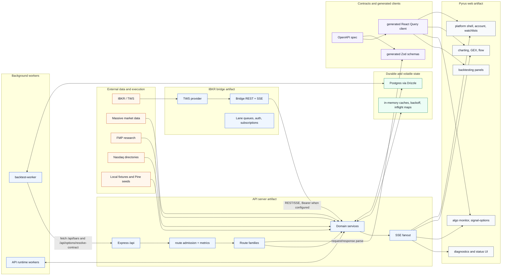

## App Data Routing Map

This is the map of where app data is ingested, routed, stored, and used. Solid arrows are runtime data flow. Dashed arrows are generated-contract flow. If a UI state looks wrong, start at the screen, follow its line back to the API surface, then to the service, cache/table, and ingest source.

### Visual Routing Map

<div class="backend-data-diagram" markdown="0">
<svg xmlns="http://www.w3.org/2000/svg" width="1600" height="1080" viewBox="0 0 1600 1080" role="img" aria-labelledby="routingMap-title routingMap-desc">
  <title id="routingMap-title">PYRUS backend data routing map</title>
  <desc id="routingMap-desc">A box and arrow map showing PYRUS data sources, ingest adapters, routing hubs, state and cache, API surfaces, client state, and app surfaces.</desc>
  <defs>
    <marker id="routingMap-arrow" viewBox="0 0 10 10" refX="8" refY="5" markerWidth="7" markerHeight="7" orient="auto-start-reverse">
      <path d="M 0 0 L 10 5 L 0 10 z" fill="#334155"/>
    </marker>
    <marker id="routingMap-arrow-purple" viewBox="0 0 10 10" refX="8" refY="5" markerWidth="7" markerHeight="7" orient="auto-start-reverse">
      <path d="M 0 0 L 10 5 L 0 10 z" fill="#6d28d9"/>
    </marker>
    <style>
      .bg { fill: #f8fafc; }
      .title { font: 700 30px Inter, "Segoe UI", Arial, sans-serif; fill: #0f172a; }
      .subtitle { font: 400 15px Inter, "Segoe UI", Arial, sans-serif; fill: #475569; }
      .column-title { font: 700 13px Inter, "Segoe UI", Arial, sans-serif; fill: #334155; letter-spacing: .04em; }
      .box-title { font: 700 15px Inter, "Segoe UI", Arial, sans-serif; fill: #0f172a; }
      .box-text { font: 400 12px Inter, "Segoe UI", Arial, sans-serif; fill: #334155; }
      .small { font: 400 11px Inter, "Segoe UI", Arial, sans-serif; fill: #475569; }
      .legend { font: 500 12px Inter, "Segoe UI", Arial, sans-serif; fill: #334155; }
      .source { fill: #fff7ed; stroke: #c2410c; }
      .adapter { fill: #fef3c7; stroke: #b45309; }
      .hub { fill: #eff6ff; stroke: #1d4ed8; }
      .state { fill: #ecfdf5; stroke: #047857; }
      .api { fill: #f5f3ff; stroke: #6d28d9; }
      .client { fill: #f8fafc; stroke: #475569; }
      .surface { fill: #fdf2f8; stroke: #be185d; }
      .box { stroke-width: 1.4; rx: 10; }
      .lane { fill: none; stroke: #cbd5e1; stroke-width: 1; stroke-dasharray: 4 5; }
      .flow { fill: none; stroke: #334155; stroke-width: 2.1; marker-end: url(#routingMap-arrow); }
      .flow-light { fill: none; stroke: #64748b; stroke-width: 1.7; marker-end: url(#routingMap-arrow); }
      .flow-dashed { fill: none; stroke: #6d28d9; stroke-width: 1.9; stroke-dasharray: 7 6; marker-end: url(#routingMap-arrow-purple); }
    </style>
  </defs>

  <rect class="bg" x="0" y="0" width="1600" height="1080"/>
  <text class="title" x="48" y="54">PYRUS Backend Data Routing Map</text>
  <text class="subtitle" x="48" y="82">Where data is ingested, routed, stored, exposed, cached in the browser, and used by the app.</text>

  <g transform="translate(1110 40)">
    <line class="flow-light" x1="0" y1="0" x2="54" y2="0"/>
    <text class="legend" x="66" y="4">runtime data</text>
    <line class="flow-dashed" x1="0" y1="28" x2="54" y2="28"/>
    <text class="legend" x="66" y="32">generated contract</text>
  </g>

  <g>
    <text class="column-title" x="58" y="126">1 SOURCE</text>
    <text class="column-title" x="278" y="126">2 INGEST</text>
    <text class="column-title" x="506" y="126">3 ROUTING HUB</text>
    <text class="column-title" x="760" y="126">4 STATE / CACHE</text>
    <text class="column-title" x="1024" y="126">5 API + CLIENT</text>
    <text class="column-title" x="1286" y="126">6 APP USE</text>
  </g>

  <g id="lane-guides">
    <rect class="lane" x="40" y="144" width="1520" height="112" rx="14"/>
    <rect class="lane" x="40" y="274" width="1520" height="112" rx="14"/>
    <rect class="lane" x="40" y="404" width="1520" height="112" rx="14"/>
    <rect class="lane" x="40" y="534" width="1520" height="112" rx="14"/>
    <rect class="lane" x="40" y="664" width="1520" height="112" rx="14"/>
    <rect class="lane" x="40" y="794" width="1520" height="112" rx="14"/>
    <rect class="lane" x="40" y="924" width="1520" height="62" rx="14"/>
  </g>

  <!-- Browser commands -->
  <rect class="box source" x="56" y="164" width="170" height="74"/>
  <text class="box-title" x="72" y="188">Browser commands</text>
  <text class="box-text" x="72" y="209">orders, settings,</text>
  <text class="box-text" x="72" y="226">watchlists, backtests</text>
  <rect class="box adapter" x="276" y="164" width="170" height="74"/>
  <text class="box-title" x="292" y="188">/api REST ingress</text>
  <text class="box-text" x="292" y="209">platform, automation,</text>
  <text class="box-text" x="292" y="226">signals, backtests</text>
  <rect class="box hub" x="500" y="164" width="190" height="74"/>
  <text class="box-title" x="516" y="188">Command hubs</text>
  <text class="box-text" x="516" y="209">broker, market, algo,</text>
  <text class="box-text" x="516" y="226">settings, backtest</text>
  <rect class="box state" x="756" y="164" width="190" height="74"/>
  <text class="box-title" x="772" y="188">Domain state</text>
  <text class="box-text" x="772" y="209">tables, route cache,</text>
  <text class="box-text" x="772" y="226">runtime maps</text>
  <rect class="box api" x="1010" y="164" width="190" height="74"/>
  <text class="box-title" x="1026" y="188">REST JSON</text>
  <text class="box-text" x="1026" y="209">generated hooks,</text>
  <text class="box-text" x="1026" y="226">React Query cache</text>
  <rect class="box surface" x="1266" y="164" width="240" height="74"/>
  <text class="box-title" x="1282" y="188">Trade, Account, Algo</text>
  <text class="box-text" x="1282" y="209">Backtest, Settings,</text>
  <text class="box-text" x="1282" y="226">Charts and watchlists</text>

  <!-- Runtime reports -->
  <rect class="box source" x="56" y="294" width="170" height="74"/>
  <text class="box-title" x="72" y="318">Browser reports</text>
  <text class="box-text" x="72" y="339">client errors, QA,</text>
  <text class="box-text" x="72" y="356">performance</text>
  <rect class="box adapter" x="276" y="294" width="170" height="74"/>
  <text class="box-title" x="292" y="318">Diagnostics ingress</text>
  <text class="box-text" x="292" y="339">browser reports,</text>
  <text class="box-text" x="292" y="356">runtime events</text>
  <rect class="box hub" x="500" y="294" width="190" height="74"/>
  <text class="box-title" x="516" y="318">Diagnostics hub</text>
  <text class="box-text" x="516" y="339">readiness, pressure,</text>
  <text class="box-text" x="516" y="356">storage health</text>
  <rect class="box state" x="756" y="294" width="190" height="74"/>
  <text class="box-title" x="772" y="318">Diagnostic state</text>
  <text class="box-text" x="772" y="339">snapshots, thresholds,</text>
  <text class="box-text" x="772" y="356">request metrics</text>
  <rect class="box api" x="1010" y="294" width="190" height="74"/>
  <text class="box-title" x="1026" y="318">REST + SSE</text>
  <text class="box-text" x="1026" y="339">health payloads,</text>
  <text class="box-text" x="1026" y="356">diagnostic stream</text>
  <rect class="box surface" x="1266" y="294" width="240" height="74"/>
  <text class="box-title" x="1282" y="318">Diagnostics surfaces</text>
  <text class="box-text" x="1282" y="339">footer, readiness,</text>
  <text class="box-text" x="1282" y="356">QA panels</text>

  <!-- IBKR -->
  <rect class="box source" x="56" y="424" width="170" height="74"/>
  <text class="box-title" x="72" y="448">IBKR / TWS</text>
  <text class="box-text" x="72" y="469">accounts, positions,</text>
  <text class="box-text" x="72" y="486">orders, options</text>
  <rect class="box adapter" x="276" y="424" width="170" height="74"/>
  <text class="box-title" x="292" y="448">IBKR bridge</text>
  <text class="box-text" x="292" y="469">REST/SSE, lanes,</text>
  <text class="box-text" x="292" y="486">auth, TWS provider</text>
  <rect class="box hub" x="500" y="424" width="190" height="74"/>
  <text class="box-title" x="516" y="448">Broker + market hubs</text>
  <text class="box-text" x="516" y="469">orders, fills, quotes,</text>
  <text class="box-text" x="516" y="486">chains, live lines</text>
  <rect class="box state" x="756" y="424" width="190" height="74"/>
  <text class="box-title" x="772" y="448">Trading state</text>
  <text class="box-text" x="772" y="469">positions, orders,</text>
  <text class="box-text" x="772" y="486">option contracts</text>
  <rect class="box api" x="1010" y="424" width="190" height="74"/>
  <text class="box-title" x="1026" y="448">REST + broker SSE</text>
  <text class="box-text" x="1026" y="469">accounts, orders,</text>
  <text class="box-text" x="1026" y="486">fills, option streams</text>
  <rect class="box surface" x="1266" y="424" width="240" height="74"/>
  <text class="box-title" x="1282" y="448">Trading app surfaces</text>
  <text class="box-text" x="1282" y="469">Trade, Account, Algo,</text>
  <text class="box-text" x="1282" y="486">Charts, Diagnostics</text>

  <!-- Massive -->
  <rect class="box source" x="56" y="554" width="170" height="74"/>
  <text class="box-title" x="72" y="578">Massive data</text>
  <text class="box-text" x="72" y="599">quotes, trades, bars,</text>
  <text class="box-text" x="72" y="616">aggregates</text>
  <rect class="box adapter" x="276" y="554" width="170" height="74"/>
  <text class="box-title" x="292" y="578">Sockets + REST</text>
  <text class="box-text" x="292" y="599">live Q/T/AM,</text>
  <text class="box-text" x="292" y="616">full fanout + backfill</text>
  <rect class="box hub" x="500" y="554" width="190" height="74"/>
  <text class="box-title" x="516" y="578">Market + signal hubs</text>
  <text class="box-text" x="516" y="599">quotes, bars, flow,</text>
  <text class="box-text" x="516" y="616">signal evaluation</text>
  <rect class="box state" x="756" y="554" width="190" height="74"/>
  <text class="box-title" x="772" y="578">Market cache</text>
  <text class="box-text" x="772" y="599">quote/bar cache,</text>
  <text class="box-text" x="772" y="616">socket snapshots</text>
  <rect class="box api" x="1010" y="554" width="190" height="74"/>
  <text class="box-title" x="1026" y="578">REST + market SSE</text>
  <text class="box-text" x="1026" y="599">snapshots, bars,</text>
  <text class="box-text" x="1026" y="616">quotes, options</text>
  <rect class="box surface" x="1266" y="554" width="240" height="74"/>
  <text class="box-title" x="1282" y="578">Market app surfaces</text>
  <text class="box-text" x="1282" y="599">Header, Watchlists,</text>
  <text class="box-text" x="1282" y="616">Charts, Flow/GEX, STA</text>

  <!-- Research/local -->
  <rect class="box source" x="56" y="684" width="170" height="74"/>
  <text class="box-title" x="72" y="708">Research + local</text>
  <text class="box-text" x="72" y="729">FMP, Nasdaq, logos,</text>
  <text class="box-text" x="72" y="746">Pine, settings</text>
  <rect class="box adapter" x="276" y="684" width="170" height="74"/>
  <text class="box-title" x="292" y="708">Reference adapters</text>
  <text class="box-text" x="292" y="729">research, universe,</text>
  <text class="box-text" x="292" y="746">settings routes</text>
  <rect class="box hub" x="500" y="684" width="190" height="74"/>
  <text class="box-title" x="516" y="708">Research + prefs hubs</text>
  <text class="box-text" x="516" y="729">universe, watchlists,</text>
  <text class="box-text" x="516" y="746">Pine, preferences</text>
  <rect class="box state" x="756" y="684" width="190" height="74"/>
  <text class="box-title" x="772" y="708">Reference state</text>
  <text class="box-text" x="772" y="729">catalogs, logos,</text>
  <text class="box-text" x="772" y="746">watchlists, fallbacks</text>
  <rect class="box api" x="1010" y="684" width="190" height="74"/>
  <text class="box-title" x="1026" y="708">REST JSON</text>
  <text class="box-text" x="1026" y="729">research, ticker,</text>
  <text class="box-text" x="1026" y="746">settings payloads</text>
  <rect class="box surface" x="1266" y="684" width="240" height="74"/>
  <text class="box-title" x="1282" y="708">Reference surfaces</text>
  <text class="box-text" x="1282" y="729">Research, search,</text>
  <text class="box-text" x="1282" y="746">chart menus, Settings</text>

  <!-- Workers and STA -->
  <rect class="box source" x="56" y="814" width="170" height="74"/>
  <text class="box-title" x="72" y="838">Runtime workers</text>
  <text class="box-text" x="72" y="859">scans, refreshes,</text>
  <text class="box-text" x="72" y="876">diagnostic samples</text>
  <rect class="box adapter" x="276" y="814" width="170" height="74"/>
  <text class="box-title" x="292" y="838">Worker adapters</text>
  <text class="box-text" x="292" y="859">Signal Options worker,</text>
  <text class="box-text" x="292" y="876">trade monitor</text>
  <rect class="box hub" x="500" y="814" width="190" height="74"/>
  <text class="box-title" x="516" y="838">Signal + STA hubs</text>
  <text class="box-text" x="516" y="859">evaluate bars, scan,</text>
  <text class="box-text" x="516" y="876">select contracts</text>
  <rect class="box state" x="756" y="814" width="190" height="74"/>
  <text class="box-title" x="772" y="838">Signal/algo state</text>
  <text class="box-text" x="772" y="859">profiles, matrix,</text>
  <text class="box-text" x="772" y="876">events, candidates</text>
  <rect class="box api" x="1010" y="814" width="190" height="74"/>
  <text class="box-title" x="1026" y="838">STA REST + cockpit</text>
  <text class="box-text" x="1026" y="859">state, matrix,</text>
  <text class="box-text" x="1026" y="876">candidates, stream</text>
  <rect class="box surface" x="1266" y="814" width="240" height="74"/>
  <text class="box-title" x="1282" y="838">Signals + Algo/STA</text>
  <text class="box-text" x="1282" y="859">Signals matrix,</text>
  <text class="box-text" x="1282" y="876">STA table/sidebar</text>

  <!-- Backtests -->
  <rect class="box source" x="56" y="944" width="170" height="54"/>
  <text class="box-title" x="72" y="967">Backtest requests</text>
  <text class="box-text" x="72" y="986">studies, runs, sweeps</text>
  <rect class="box adapter" x="276" y="944" width="170" height="54"/>
  <text class="box-title" x="292" y="967">Backtest worker</text>
  <text class="box-text" x="292" y="986">claim jobs, fetch API</text>
  <rect class="box hub" x="500" y="944" width="190" height="54"/>
  <text class="box-title" x="516" y="967">Backtest hub</text>
  <text class="box-text" x="516" y="986">jobs, simulate, read</text>
  <rect class="box state" x="756" y="944" width="190" height="54"/>
  <text class="box-title" x="772" y="967">Backtest tables</text>
  <text class="box-text" x="772" y="986">runs, trades, points</text>
  <rect class="box api" x="1010" y="944" width="190" height="54"/>
  <text class="box-title" x="1026" y="967">REST JSON</text>
  <text class="box-text" x="1026" y="986">results, warnings</text>
  <rect class="box surface" x="1266" y="944" width="240" height="54"/>
  <text class="box-title" x="1282" y="967">Backtesting UI</text>
  <text class="box-text" x="1282" y="986">charts, promotion drafts</text>

  <!-- Horizontal connectors -->
  <g>
    <line class="flow" x1="226" y1="201" x2="276" y2="201"/>
    <line class="flow" x1="446" y1="201" x2="500" y2="201"/>
    <line class="flow" x1="690" y1="201" x2="756" y2="201"/>
    <line class="flow" x1="946" y1="201" x2="1010" y2="201"/>
    <line class="flow" x1="1200" y1="201" x2="1266" y2="201"/>

    <line class="flow" x1="226" y1="331" x2="276" y2="331"/>
    <line class="flow" x1="446" y1="331" x2="500" y2="331"/>
    <line class="flow" x1="690" y1="331" x2="756" y2="331"/>
    <line class="flow" x1="946" y1="331" x2="1010" y2="331"/>
    <line class="flow" x1="1200" y1="331" x2="1266" y2="331"/>

    <line class="flow" x1="226" y1="461" x2="276" y2="461"/>
    <line class="flow" x1="446" y1="461" x2="500" y2="461"/>
    <line class="flow" x1="690" y1="461" x2="756" y2="461"/>
    <line class="flow" x1="946" y1="461" x2="1010" y2="461"/>
    <line class="flow" x1="1200" y1="461" x2="1266" y2="461"/>

    <line class="flow" x1="226" y1="591" x2="276" y2="591"/>
    <line class="flow" x1="446" y1="591" x2="500" y2="591"/>
    <line class="flow" x1="690" y1="591" x2="756" y2="591"/>
    <line class="flow" x1="946" y1="591" x2="1010" y2="591"/>
    <line class="flow" x1="1200" y1="591" x2="1266" y2="591"/>

    <line class="flow" x1="226" y1="721" x2="276" y2="721"/>
    <line class="flow" x1="446" y1="721" x2="500" y2="721"/>
    <line class="flow" x1="690" y1="721" x2="756" y2="721"/>
    <line class="flow" x1="946" y1="721" x2="1010" y2="721"/>
    <line class="flow" x1="1200" y1="721" x2="1266" y2="721"/>

    <line class="flow" x1="226" y1="851" x2="276" y2="851"/>
    <line class="flow" x1="446" y1="851" x2="500" y2="851"/>
    <line class="flow" x1="690" y1="851" x2="756" y2="851"/>
    <line class="flow" x1="946" y1="851" x2="1010" y2="851"/>
    <line class="flow" x1="1200" y1="851" x2="1266" y2="851"/>

    <line class="flow" x1="226" y1="971" x2="276" y2="971"/>
    <line class="flow" x1="446" y1="971" x2="500" y2="971"/>
    <line class="flow" x1="690" y1="971" x2="756" y2="971"/>
    <line class="flow" x1="946" y1="971" x2="1010" y2="971"/>
    <line class="flow" x1="1200" y1="971" x2="1266" y2="971"/>
  </g>

</svg>
</div>

### Data Wiring Diagnostic Map

Use this when a frontend symptom appears. It maps the symptom to the owning client surface, API/stream, backend hub, state/source, and the rule that usually explains the fix.

<div class="backend-data-diagram" markdown="0">
<svg xmlns="http://www.w3.org/2000/svg" width="1800" height="1380" viewBox="0 0 1800 1380" role="img" aria-labelledby="diagnosticMap-title diagnosticMap-desc">
  <title id="diagnosticMap-title">PYRUS backend data wiring diagnostic map</title>
  <desc id="diagnosticMap-desc">A symptom-driven diagnostic map for PYRUS data wiring issues, showing the frontend surface, API or stream, backend hub, state or source, and the repair rule.</desc>
  <defs>
    <marker id="diagnosticMap-arrow" viewBox="0 0 10 10" refX="8" refY="5" markerWidth="7" markerHeight="7" orient="auto-start-reverse">
      <path d="M 0 0 L 10 5 L 0 10 z" fill="#334155"/>
    </marker>
    <style>
      .bg { fill: #f8fafc; }
      .title { font: 700 30px Inter, "Segoe UI", Arial, sans-serif; fill: #0f172a; }
      .subtitle { font: 400 15px Inter, "Segoe UI", Arial, sans-serif; fill: #475569; }
      .column-title { font: 700 13px Inter, "Segoe UI", Arial, sans-serif; fill: #334155; letter-spacing: .04em; }
      .box-title { font: 700 14px Inter, "Segoe UI", Arial, sans-serif; fill: #0f172a; }
      .box-text { font: 400 11.5px Inter, "Segoe UI", Arial, sans-serif; fill: #334155; }
      .box { stroke-width: 1.35; rx: 9; }
      .lane { fill: none; stroke: #cbd5e1; stroke-width: 1; stroke-dasharray: 4 5; }
      .symptom { fill: #fff1f2; stroke: #e11d48; }
      .client { fill: #f8fafc; stroke: #475569; }
      .api { fill: #f5f3ff; stroke: #6d28d9; }
      .hub { fill: #eff6ff; stroke: #1d4ed8; }
      .state { fill: #ecfdf5; stroke: #047857; }
      .rule { fill: #fff7ed; stroke: #c2410c; }
      .flow { fill: none; stroke: #334155; stroke-width: 1.8; marker-end: url(#diagnosticMap-arrow); }
    </style>
  </defs>

  <rect class="bg" x="0" y="0" width="1800" height="1380"/>
  <text class="title" x="48" y="54">PYRUS Data Wiring Diagnostic Map</text>
  <text class="subtitle" x="48" y="82">Start with the visible symptom, then follow the line to the client store, API transport, backend hub, state/source, and repair rule.</text>

  <text class="column-title" x="58" y="126">VISIBLE SYMPTOM</text>
  <text class="column-title" x="318" y="126">CLIENT OWNER</text>
  <text class="column-title" x="578" y="126">API / STREAM</text>
  <text class="column-title" x="858" y="126">BACKEND HUB</text>
  <text class="column-title" x="1138" y="126">STATE / SOURCE</text>
  <text class="column-title" x="1438" y="126">REPAIR RULE</text>

  <g id="lanes">
    <rect class="lane" x="40" y="144" width="1720" height="96" rx="12"/>
    <rect class="lane" x="40" y="256" width="1720" height="96" rx="12"/>
    <rect class="lane" x="40" y="368" width="1720" height="96" rx="12"/>
    <rect class="lane" x="40" y="480" width="1720" height="96" rx="12"/>
    <rect class="lane" x="40" y="592" width="1720" height="96" rx="12"/>
    <rect class="lane" x="40" y="704" width="1720" height="96" rx="12"/>
    <rect class="lane" x="40" y="816" width="1720" height="96" rx="12"/>
    <rect class="lane" x="40" y="928" width="1720" height="96" rx="12"/>
    <rect class="lane" x="40" y="1040" width="1720" height="96" rx="12"/>
    <rect class="lane" x="40" y="1152" width="1720" height="96" rx="12"/>
  </g>

  <!-- Row helper positions: symptom x56 w220, client x312 w220, api x572 w240, hub x854 w238, state x1130 w248, rule x1426 w300 -->
  <g id="rows">
    <g transform="translate(0 0)">
      <rect class="box symptom" x="56" y="160" width="220" height="64"/>
      <text class="box-title" x="72" y="184">Missing/stale price</text>
      <text class="box-text" x="72" y="205">watchlist, header, quote cell</text>
      <rect class="box client" x="312" y="160" width="220" height="64"/>
      <text class="box-title" x="328" y="184">Quote stores/hooks</text>
      <text class="box-text" x="328" y="205">watchlist + runtime market data</text>
      <rect class="box api" x="572" y="160" width="240" height="64"/>
      <text class="box-title" x="588" y="184">/quotes + quote streams</text>
      <text class="box-text" x="588" y="205">/quotes/snapshot, /streams/quotes</text>
      <rect class="box hub" x="854" y="160" width="238" height="64"/>
      <text class="box-title" x="870" y="184">Market-data hub</text>
      <text class="box-text" x="870" y="205">Massive-first quotes where live</text>
      <rect class="box state" x="1130" y="160" width="248" height="64"/>
      <text class="box-title" x="1146" y="184">Socket + quote cache</text>
      <text class="box-text" x="1146" y="205">source, ageMs, delayed, stale</text>
      <rect class="box rule" x="1426" y="160" width="300" height="64"/>
      <text class="box-title" x="1442" y="184">Never let REST-empty wipe live</text>
      <text class="box-text" x="1442" y="205">preserve source/freshness in UI</text>
    </g>

    <g transform="translate(0 112)">
      <rect class="box symptom" x="56" y="160" width="220" height="64"/>
      <text class="box-title" x="72" y="184">Chart/bar stale</text>
      <text class="box-text" x="72" y="205">wrong candles, old overlay data</text>
      <rect class="box client" x="312" y="160" width="220" height="64"/>
      <text class="box-title" x="328" y="184">Chart hooks</text>
      <text class="box-text" x="328" y="205">bars, aggregate streams, overlays</text>
      <rect class="box api" x="572" y="160" width="240" height="64"/>
      <text class="box-title" x="588" y="184">/bars + /streams/bars</text>
      <text class="box-text" x="588" y="205">symbol, timeframe, source, range</text>
      <rect class="box hub" x="854" y="160" width="238" height="64"/>
      <text class="box-title" x="870" y="184">Market-data store</text>
      <text class="box-text" x="870" y="205">bars, synthesis, provider fallback</text>
      <rect class="box state" x="1130" y="160" width="248" height="64"/>
      <text class="box-title" x="1146" y="184">bar_cache + datasets</text>
      <text class="box-text" x="1146" y="205">identity includes timeframe/source</text>
      <rect class="box rule" x="1426" y="160" width="300" height="64"/>
      <text class="box-title" x="1442" y="184">Reject stale stream payloads</text>
      <text class="box-text" x="1442" y="205">never mix symbol/timeframe/source keys</text>
    </g>

    <g transform="translate(0 224)">
      <rect class="box symptom" x="56" y="160" width="220" height="64"/>
      <text class="box-title" x="72" y="184">Signal matrix holes</text>
      <text class="box-text" x="72" y="205">empty bubbles, partial intervals</text>
      <rect class="box client" x="312" y="160" width="220" height="64"/>
      <text class="box-title" x="328" y="184">Signal schedulers</text>
      <text class="box-text" x="328" y="205">Signals + STA table/sidebar</text>
      <rect class="box api" x="572" y="160" width="240" height="64"/>
      <text class="box-title" x="588" y="184">/signal-monitor/matrix</text>
      <text class="box-text" x="588" y="205">clientRole + requestOrigin matter</text>
      <rect class="box hub" x="854" y="160" width="238" height="64"/>
      <text class="box-title" x="870" y="184">Signal-monitor hub</text>
      <text class="box-text" x="870" y="205">exact cells, stored + source refresh</text>
      <rect class="box state" x="1130" y="160" width="248" height="64"/>
      <text class="box-title" x="1146" y="184">matrix states + cache</text>
      <text class="box-text" x="1146" y="205">profile, symbol, timeframe, mode</text>
      <rect class="box rule" x="1426" y="160" width="300" height="64"/>
      <text class="box-title" x="1442" y="184">Exact-cell requests must say why</text>
      <text class="box-text" x="1442" y="205">table/sidebar gaps source-fill</text>
    </g>

    <g transform="translate(0 336)">
      <rect class="box symptom" x="56" y="160" width="220" height="64"/>
      <text class="box-title" x="72" y="184">STA candidate missing</text>
      <text class="box-text" x="72" y="205">Monitor only, pending, blocker</text>
      <rect class="box client" x="312" y="160" width="220" height="64"/>
      <text class="box-title" x="328" y="184">Algo STA table</text>
      <text class="box-text" x="328" y="205">stable action snapshot + health</text>
      <rect class="box api" x="572" y="160" width="240" height="64"/>
      <text class="box-title" x="588" y="184">STA state + cockpit</text>
      <text class="box-text" x="588" y="205">/signal-options/state, cockpit SSE</text>
      <rect class="box hub" x="854" y="160" width="238" height="64"/>
      <text class="box-title" x="870" y="184">Signal Options hub</text>
      <text class="box-text" x="870" y="205">candidate shell, contract selection</text>
      <rect class="box state" x="1130" y="160" width="248" height="64"/>
      <text class="box-title" x="1146" y="184">candidate cache + events</text>
      <text class="box-text" x="1146" y="205">selectedContract, actionStatus</text>
      <rect class="box rule" x="1426" y="160" width="300" height="64"/>
      <text class="box-title" x="1442" y="184">Actionable signal needs shell</text>
      <text class="box-text" x="1442" y="205">Monitor only means non-actionable</text>
    </g>

    <g transform="translate(0 448)">
      <rect class="box symptom" x="56" y="160" width="220" height="64"/>
      <text class="box-title" x="72" y="184">Order/fill mismatch</text>
      <text class="box-text" x="72" y="205">pending, rejected, stale fills</text>
      <rect class="box client" x="312" y="160" width="220" height="64"/>
      <text class="box-title" x="328" y="184">Trade + algo order UI</text>
      <text class="box-text" x="328" y="205">preview, submit, replace, cancel</text>
      <rect class="box api" x="572" y="160" width="240" height="64"/>
      <text class="box-title" x="588" y="184">orders + executions</text>
      <text class="box-text" x="588" y="205">REST commands, order/fill streams</text>
      <rect class="box hub" x="854" y="160" width="238" height="64"/>
      <text class="box-title" x="870" y="184">Broker/order hub</text>
      <text class="box-text" x="870" y="205">IBKR bridge or shadow engine</text>
      <rect class="box state" x="1130" y="160" width="248" height="64"/>
      <text class="box-title" x="1146" y="184">order/fill tables</text>
      <text class="box-text" x="1146" y="205">order request, broker order, fill</text>
      <rect class="box rule" x="1426" y="160" width="300" height="64"/>
      <text class="box-title" x="1442" y="184">Do not hide broker reasons</text>
      <text class="box-text" x="1442" y="205">idempotency + state checks explicit</text>
    </g>

    <g transform="translate(0 560)">
      <rect class="box symptom" x="56" y="160" width="220" height="64"/>
      <text class="box-title" x="72" y="184">Account/PnL lag</text>
      <text class="box-text" x="72" y="205">positions, risk, allocation stale</text>
      <rect class="box client" x="312" y="160" width="220" height="64"/>
      <text class="box-title" x="328" y="184">Account screen stores</text>
      <text class="box-text" x="328" y="205">snapshot + account-page stream</text>
      <rect class="box api" x="572" y="160" width="240" height="64"/>
      <text class="box-title" x="588" y="184">accounts REST + SSE</text>
      <text class="box-text" x="588" y="205">summary, positions, account page</text>
      <rect class="box hub" x="854" y="160" width="238" height="64"/>
      <text class="box-title" x="870" y="184">Account hub</text>
      <text class="box-text" x="870" y="205">IBKR, Flex, shadow account</text>
      <rect class="box state" x="1130" y="160" width="248" height="64"/>
      <text class="box-title" x="1146" y="184">trading + shadow state</text>
      <text class="box-text" x="1146" y="205">positions, marks, balances</text>
      <rect class="box rule" x="1426" y="160" width="300" height="64"/>
      <text class="box-title" x="1442" y="184">Show source and degradation</text>
      <text class="box-text" x="1442" y="205">critical first event before heavy slices</text>
    </g>

    <g transform="translate(0 672)">
      <rect class="box symptom" x="56" y="160" width="220" height="64"/>
      <text class="box-title" x="72" y="184">Flow/GEX stale</text>
      <text class="box-text" x="72" y="205">old tape, wrong occurrence time</text>
      <rect class="box client" x="312" y="160" width="220" height="64"/>
      <text class="box-title" x="328" y="184">Flow/GEX views</text>
      <text class="box-text" x="328" y="205">flow tape, scanner, heatmaps</text>
      <rect class="box api" x="572" y="160" width="240" height="64"/>
      <text class="box-title" x="588" y="184">flow + GEX routes</text>
      <text class="box-text" x="588" y="205">events, aggregate, gex snapshots</text>
      <rect class="box hub" x="854" y="160" width="238" height="64"/>
      <text class="box-title" x="870" y="184">Flow/GEX hub</text>
      <text class="box-text" x="870" y="205">computed + provider data</text>
      <rect class="box state" x="1130" y="160" width="248" height="64"/>
      <text class="box-title" x="1146" y="184">flow/GEX snapshots</text>
      <text class="box-text" x="1146" y="205">event time, source basis, cache</text>
      <rect class="box rule" x="1426" y="160" width="300" height="64"/>
      <text class="box-title" x="1442" y="184">Occurrence time beats discovery</text>
      <text class="box-text" x="1442" y="205">stale/cached must not look live</text>
    </g>

    <g transform="translate(0 784)">
      <rect class="box symptom" x="56" y="160" width="220" height="64"/>
      <text class="box-title" x="72" y="184">Search/research missing</text>
      <text class="box-text" x="72" y="205">no ticker, logo, filing, snapshot</text>
      <rect class="box client" x="312" y="160" width="220" height="64"/>
      <text class="box-title" x="328" y="184">Research/search UI</text>
      <text class="box-text" x="328" y="205">ticker search, research panels</text>
      <rect class="box api" x="572" y="160" width="240" height="64"/>
      <text class="box-title" x="588" y="184">research + universe</text>
      <text class="box-text" x="588" y="205">FMP, Nasdaq, logos, proxy</text>
      <rect class="box hub" x="854" y="160" width="238" height="64"/>
      <text class="box-title" x="870" y="184">Research/universe hub</text>
      <text class="box-text" x="870" y="205">normalize symbols early</text>
      <rect class="box state" x="1130" y="160" width="248" height="64"/>
      <text class="box-title" x="1146" y="184">reference cache</text>
      <text class="box-text" x="1146" y="205">catalogs, rankings, provider cache</text>
      <rect class="box rule" x="1426" y="160" width="300" height="64"/>
      <text class="box-title" x="1442" y="184">Separate no-data from failure</text>
      <text class="box-text" x="1442" y="205">logo proxy must constrain upstream</text>
    </g>

    <g transform="translate(0 896)">
      <rect class="box symptom" x="56" y="160" width="220" height="64"/>
      <text class="box-title" x="72" y="184">API pressure/slow UI</text>
      <text class="box-text" x="72" y="205">timeouts, stale source, high p95</text>
      <rect class="box client" x="312" y="160" width="220" height="64"/>
      <text class="box-title" x="328" y="184">All consumers</text>
      <text class="box-text" x="328" y="205">queries, streams, work scheduler</text>
      <rect class="box api" x="572" y="160" width="240" height="64"/>
      <text class="box-title" x="588" y="184">diagnostics routes</text>
      <text class="box-text" x="588" y="205">latest, events, runtime, line usage</text>
      <rect class="box hub" x="854" y="160" width="238" height="64"/>
      <text class="box-title" x="870" y="184">Pressure/admission hub</text>
      <text class="box-text" x="870" y="205">route metrics, pressure drivers</text>
      <rect class="box state" x="1130" y="160" width="248" height="64"/>
      <text class="box-title" x="1146" y="184">diagnostics memory + DB</text>
      <text class="box-text" x="1146" y="205">slow routes, event-loop, RSS</text>
      <rect class="box rule" x="1426" y="160" width="300" height="64"/>
      <text class="box-title" x="1442" y="184">Pressure is a control signal</text>
      <text class="box-text" x="1442" y="205">name driver; defer heavy work only</text>
    </g>

    <g transform="translate(0 1008)">
      <rect class="box symptom" x="56" y="160" width="220" height="64"/>
      <text class="box-title" x="72" y="184">Backtest stuck/wrong</text>
      <text class="box-text" x="72" y="205">queued forever, bad fills, no chart</text>
      <rect class="box client" x="312" y="160" width="220" height="64"/>
      <text class="box-title" x="328" y="184">Backtest UI</text>
      <text class="box-text" x="328" y="205">study, run, sweep, promotion</text>
      <rect class="box api" x="572" y="160" width="240" height="64"/>
      <text class="box-title" x="588" y="184">backtest REST + /bars</text>
      <text class="box-text" x="588" y="205">worker fetches API bars/contracts</text>
      <rect class="box hub" x="854" y="160" width="238" height="64"/>
      <text class="box-title" x="870" y="184">Backtest hub + worker</text>
      <text class="box-text" x="870" y="205">job claim, simulate, persist</text>
      <rect class="box state" x="1130" y="160" width="248" height="64"/>
      <text class="box-title" x="1146" y="184">backtest tables</text>
      <text class="box-text" x="1146" y="205">jobs, datasets, points, trades</text>
      <rect class="box rule" x="1426" y="160" width="300" height="64"/>
      <text class="box-title" x="1442" y="184">Worker owns outputs</text>
      <text class="box-text" x="1442" y="205">warnings are data; preserve them</text>
    </g>
  </g>

  <g id="connectors">
    <g transform="translate(0 0)">
      <line class="flow" x1="276" y1="192" x2="312" y2="192"/>
      <line class="flow" x1="532" y1="192" x2="572" y2="192"/>
      <line class="flow" x1="812" y1="192" x2="854" y2="192"/>
      <line class="flow" x1="1092" y1="192" x2="1130" y2="192"/>
      <line class="flow" x1="1378" y1="192" x2="1426" y2="192"/>
    </g>
    <g transform="translate(0 112)">
      <line class="flow" x1="276" y1="192" x2="312" y2="192"/>
      <line class="flow" x1="532" y1="192" x2="572" y2="192"/>
      <line class="flow" x1="812" y1="192" x2="854" y2="192"/>
      <line class="flow" x1="1092" y1="192" x2="1130" y2="192"/>
      <line class="flow" x1="1378" y1="192" x2="1426" y2="192"/>
    </g>
    <g transform="translate(0 224)">
      <line class="flow" x1="276" y1="192" x2="312" y2="192"/>
      <line class="flow" x1="532" y1="192" x2="572" y2="192"/>
      <line class="flow" x1="812" y1="192" x2="854" y2="192"/>
      <line class="flow" x1="1092" y1="192" x2="1130" y2="192"/>
      <line class="flow" x1="1378" y1="192" x2="1426" y2="192"/>
    </g>
    <g transform="translate(0 336)">
      <line class="flow" x1="276" y1="192" x2="312" y2="192"/>
      <line class="flow" x1="532" y1="192" x2="572" y2="192"/>
      <line class="flow" x1="812" y1="192" x2="854" y2="192"/>
      <line class="flow" x1="1092" y1="192" x2="1130" y2="192"/>
      <line class="flow" x1="1378" y1="192" x2="1426" y2="192"/>
    </g>
    <g transform="translate(0 448)">
      <line class="flow" x1="276" y1="192" x2="312" y2="192"/>
      <line class="flow" x1="532" y1="192" x2="572" y2="192"/>
      <line class="flow" x1="812" y1="192" x2="854" y2="192"/>
      <line class="flow" x1="1092" y1="192" x2="1130" y2="192"/>
      <line class="flow" x1="1378" y1="192" x2="1426" y2="192"/>
    </g>
    <g transform="translate(0 560)">
      <line class="flow" x1="276" y1="192" x2="312" y2="192"/>
      <line class="flow" x1="532" y1="192" x2="572" y2="192"/>
      <line class="flow" x1="812" y1="192" x2="854" y2="192"/>
      <line class="flow" x1="1092" y1="192" x2="1130" y2="192"/>
      <line class="flow" x1="1378" y1="192" x2="1426" y2="192"/>
    </g>
    <g transform="translate(0 672)">
      <line class="flow" x1="276" y1="192" x2="312" y2="192"/>
      <line class="flow" x1="532" y1="192" x2="572" y2="192"/>
      <line class="flow" x1="812" y1="192" x2="854" y2="192"/>
      <line class="flow" x1="1092" y1="192" x2="1130" y2="192"/>
      <line class="flow" x1="1378" y1="192" x2="1426" y2="192"/>
    </g>
    <g transform="translate(0 784)">
      <line class="flow" x1="276" y1="192" x2="312" y2="192"/>
      <line class="flow" x1="532" y1="192" x2="572" y2="192"/>
      <line class="flow" x1="812" y1="192" x2="854" y2="192"/>
      <line class="flow" x1="1092" y1="192" x2="1130" y2="192"/>
      <line class="flow" x1="1378" y1="192" x2="1426" y2="192"/>
    </g>
    <g transform="translate(0 896)">
      <line class="flow" x1="276" y1="192" x2="312" y2="192"/>
      <line class="flow" x1="532" y1="192" x2="572" y2="192"/>
      <line class="flow" x1="812" y1="192" x2="854" y2="192"/>
      <line class="flow" x1="1092" y1="192" x2="1130" y2="192"/>
      <line class="flow" x1="1378" y1="192" x2="1426" y2="192"/>
    </g>
    <g transform="translate(0 1008)">
      <line class="flow" x1="276" y1="192" x2="312" y2="192"/>
      <line class="flow" x1="532" y1="192" x2="572" y2="192"/>
      <line class="flow" x1="812" y1="192" x2="854" y2="192"/>
      <line class="flow" x1="1092" y1="192" x2="1130" y2="192"/>
      <line class="flow" x1="1378" y1="192" x2="1426" y2="192"/>
    </g>
  </g>
</svg>
</div>

### Data Use Rules

Use this before changing backend routes, streams, generated clients, frontend caches, trading flows, signal/STA behavior, or operational startup behavior.

<div class="backend-data-diagram" markdown="0">
<svg xmlns="http://www.w3.org/2000/svg" width="1600" height="1080" viewBox="0 0 1600 1080" role="img" aria-labelledby="rulesMap-title rulesMap-desc">
  <title id="rulesMap-title">PYRUS frontend and backend data-use rules</title>
  <desc id="rulesMap-desc">A visual rules map for PYRUS backend data, API transports, generated contracts, frontend cache behavior, and high-risk trading or signal paths.</desc>
  <defs>
    <style>
      .bg { fill: #f8fafc; }
      .title { font: 700 30px Inter, "Segoe UI", Arial, sans-serif; fill: #0f172a; }
      .subtitle { font: 400 15px Inter, "Segoe UI", Arial, sans-serif; fill: #475569; }
      .section-title { font: 700 16px Inter, "Segoe UI", Arial, sans-serif; fill: #0f172a; }
      .rule-title { font: 700 14px Inter, "Segoe UI", Arial, sans-serif; fill: #0f172a; }
      .rule-text { font: 400 12px Inter, "Segoe UI", Arial, sans-serif; fill: #334155; }
      .panel { fill: #ffffff; stroke: #cbd5e1; stroke-width: 1.4; rx: 14; }
      .api { fill: #f5f3ff; stroke: #6d28d9; }
      .front { fill: #eff6ff; stroke: #1d4ed8; }
      .back { fill: #ecfdf5; stroke: #047857; }
      .risk { fill: #fff1f2; stroke: #e11d48; }
      .ops { fill: #fff7ed; stroke: #c2410c; }
      .line-contract { fill: #e0f2fe; stroke: #0369a1; }
      .rule { stroke-width: 1.25; rx: 10; }
    </style>
  </defs>

  <rect class="bg" width="1600" height="1080"/>
  <text class="title" x="48" y="54">PYRUS Data Use Rules</text>
  <text class="subtitle" x="48" y="82">Use this with the routing and diagnostic maps. Each rule is a boundary that must survive backend changes and frontend projections.</text>

  <g transform="translate(48 108)">
    <rect class="rule line-contract" x="0" y="0" width="1504" height="58"/>
    <text class="rule-title" x="24" y="24">Data-line contract</text>
    <text class="rule-text" x="24" y="43">Every routed data line must expose owner, identity, source, freshness, actionability when relevant, and concrete failure reason. Missing fields make wiring defects non-diagnostic.</text>
  </g>

  <g transform="translate(48 184)">
    <rect class="panel" x="0" y="0" width="492" height="380"/>
    <text class="section-title" x="24" y="34">API + Contract Rules</text>
    <rect class="rule api" x="24" y="58" width="444" height="54"/>
    <text class="rule-title" x="42" y="80">OpenAPI is the REST contract</text>
    <text class="rule-text" x="42" y="99">Change spec, run codegen/audits, then consume generated clients.</text>
    <rect class="rule api" x="24" y="126" width="444" height="54"/>
    <text class="rule-title" x="42" y="148">Validate all boundaries</text>
    <text class="rule-text" x="42" y="167">Bodies, params, browser reports, bridge/provider payloads.</text>
    <rect class="rule api" x="24" y="194" width="444" height="54"/>
    <text class="rule-title" x="42" y="216">Problem responses must stay concrete</text>
    <text class="rule-text" x="42" y="235">Keep Zod, upstream, broker, and unknown errors distinct.</text>
    <rect class="rule api" x="24" y="262" width="444" height="54"/>
    <text class="rule-title" x="42" y="284">SSE readiness is transport readiness</text>
    <text class="rule-text" x="42" y="303">A ready event does not prove upstream data is fresh or complete.</text>
    <rect class="rule api" x="24" y="330" width="444" height="34"/>
    <text class="rule-title" x="42" y="352">Do not edit generated files directly.</text>
  </g>

  <g transform="translate(554 184)">
    <rect class="panel" x="0" y="0" width="492" height="380"/>
    <text class="section-title" x="24" y="34">Frontend Use Rules</text>
    <rect class="rule front" x="24" y="58" width="444" height="54"/>
    <text class="rule-title" x="42" y="80">Use generated hooks for REST</text>
    <text class="rule-text" x="42" y="99">Only direct EventSource consumers should bypass generated clients.</text>
    <rect class="rule front" x="24" y="126" width="444" height="54"/>
    <text class="rule-title" x="42" y="148">Preserve source and freshness fields</text>
    <text class="rule-text" x="42" y="167">UI labels must not invent live, complete, or actionable state.</text>
    <rect class="rule front" x="24" y="194" width="444" height="54"/>
    <text class="rule-title" x="42" y="216">Query keys are identity</text>
    <text class="rule-text" x="42" y="235">Include symbol, timeframe, profile, source, account, mode.</text>
    <rect class="rule front" x="24" y="262" width="444" height="54"/>
    <text class="rule-title" x="42" y="284">Keep stable last-good source snapshots</text>
    <text class="rule-text" x="42" y="303">For STA/action sources, do not shrink rows on transient source failure.</text>
    <rect class="rule front" x="24" y="330" width="444" height="34"/>
    <text class="rule-title" x="42" y="352">Display degradation and stale reasons explicitly.</text>
  </g>

  <g transform="translate(1060 184)">
    <rect class="panel" x="0" y="0" width="492" height="380"/>
    <text class="section-title" x="24" y="34">Backend Service Rules</text>
    <rect class="rule back" x="24" y="58" width="444" height="54"/>
    <text class="rule-title" x="42" y="80">Keep metadata separate from live data</text>
    <text class="rule-text" x="42" y="99">Contract discovery, quote hydration, greeks, spread stay separate.</text>
    <rect class="rule back" x="24" y="126" width="444" height="54"/>
    <text class="rule-title" x="42" y="148">Caches must be honest</text>
    <text class="rule-text" x="42" y="167">Name live, cached, fallback, synthesized, stale, or unavailable.</text>
    <rect class="rule back" x="24" y="194" width="444" height="54"/>
    <text class="rule-title" x="42" y="216">Admission/backoff are control signals</text>
    <text class="rule-text" x="42" y="235">Pressure, pacing, lane capacity, and drain timeout drive behavior.</text>
    <rect class="rule back" x="24" y="262" width="444" height="54"/>
    <text class="rule-title" x="42" y="284">Provider failures are not no-data</text>
    <text class="rule-text" x="42" y="303">Keep auth, pacing, upstream, empty-result states distinct.</text>
    <rect class="rule back" x="24" y="330" width="444" height="34"/>
    <text class="rule-title" x="42" y="352">Normalize symbols and identities before storage.</text>
  </g>

  <g transform="translate(48 604)">
    <rect class="panel" x="0" y="0" width="492" height="360"/>
    <text class="section-title" x="24" y="34">High-Risk Trading Rules</text>
    <rect class="rule risk" x="24" y="58" width="444" height="54"/>
    <text class="rule-title" x="42" y="80">Validate preview and submit inputs</text>
    <text class="rule-text" x="42" y="99">Account, symbol, side, quantity, order type, and idempotency matter.</text>
    <rect class="rule risk" x="24" y="126" width="444" height="54"/>
    <text class="rule-title" x="42" y="148">Never hide broker rejection details</text>
    <text class="rule-text" x="42" y="167">User-facing trading surfaces need concrete reason codes.</text>
    <rect class="rule risk" x="24" y="194" width="444" height="54"/>
    <text class="rule-title" x="42" y="216">Execution events are the durable story</text>
    <text class="rule-text" x="42" y="235">Distinguish scan, decision, preview, submit, fill, cancel, reject.</text>
    <rect class="rule risk" x="24" y="262" width="444" height="54"/>
    <text class="rule-title" x="42" y="284">Account/order data is sensitive</text>
    <text class="rule-text" x="42" y="303">Avoid logging tokens, activation envelopes, secrets, or raw payloads.</text>
  </g>

  <g transform="translate(554 604)">
    <rect class="panel" x="0" y="0" width="492" height="360"/>
    <text class="section-title" x="24" y="34">Signal + STA Rules</text>
    <rect class="rule ops" x="24" y="58" width="444" height="54"/>
    <text class="rule-title" x="42" y="80">Actionable signal requires a candidate shell</text>
    <text class="rule-text" x="42" y="99">Even cache-only/summary paths must expose candidate state.</text>
    <rect class="rule ops" x="24" y="126" width="444" height="54"/>
    <text class="rule-title" x="42" y="148">Monitor only means non-actionable</text>
    <text class="rule-text" x="42" y="167">Missing candidate for actionEligible=true is errant/blocker data.</text>
    <rect class="rule ops" x="24" y="194" width="444" height="54"/>
    <text class="rule-title" x="42" y="216">Contract selection belongs in backend payload</text>
    <text class="rule-text" x="42" y="235">Expose status, selected contract, quote demand, backoff, reason.</text>
    <rect class="rule ops" x="24" y="262" width="444" height="54"/>
    <text class="rule-title" x="42" y="284">STA table/sidebar share Matrix context</text>
    <text class="rule-text" x="42" y="303">Both use algo-sta + sta-visible-page exact cells.</text>
  </g>

  <g transform="translate(1060 604)">
    <rect class="panel" x="0" y="0" width="492" height="360"/>
    <text class="section-title" x="24" y="34">Operations + Maintenance Rules</text>
    <rect class="rule ops" x="24" y="58" width="444" height="54"/>
    <text class="rule-title" x="42" y="80">Do not make startup changes casually</text>
    <text class="rule-text" x="42" y="99">Replit startup files require explicit maintenance and audit.</text>
    <rect class="rule ops" x="24" y="126" width="444" height="54"/>
    <text class="rule-title" x="42" y="148">Update this map when data behavior changes</text>
    <text class="rule-text" x="42" y="167">New provider, table, endpoint, stream, worker, or major consumer.</text>
    <rect class="rule ops" x="24" y="194" width="444" height="54"/>
    <text class="rule-title" x="42" y="216">Use pressure diagnostics before guessing</text>
    <text class="rule-text" x="42" y="235">Inspect p95, event loop, slow routes, source health, line usage.</text>
    <rect class="rule ops" x="24" y="262" width="444" height="54"/>
    <text class="rule-title" x="42" y="284">Prefer domain-level changes</text>
    <text class="rule-text" x="42" y="303">Routes, services, DB, OpenAPI, generated clients, UI are coupled.</text>
  </g>
</svg>
</div>

### How To Diagnose A Data Wiring Issue

Use this protocol for any visible UI symptom. The goal is to find the first boundary where identity, source, freshness, actionability, or failure reason disappears.

| Step | Check | If It Fails |
|---|---|---|
| 1. Name the symptom | Match the visible state to a row in `Data Wiring Diagnostic Map`. | Add a diagnostic row before fixing code; undocumented symptoms become repeated regressions. |
| 2. Identify the client owner | Find the hook, store, scheduler, or EventSource reducer that owns the screen state. | Fix query keys, merge policy, or stale reducer behavior only if the backend payload is already correct. |
| 3. Inspect the API/stream boundary | Confirm the route, stream event, generated schema, request metadata, and response envelope. | Update `openapi.yaml` and generated clients for REST drift; update direct stream consumers for SSE drift. |
| 4. Inspect the backend hub | Find the domain service that selected, joined, cached, or degraded the data. | Prefer a domain fix over a UI label fix when candidate selection, provider choice, admission, or fallback is wrong. |
| 5. Inspect state/source | Check DB rows, in-memory cache, provider/bridge payload, source age, and stale/degraded flags. | Preserve source and failure detail; do not convert provider failure, missing state, or pacing into no-data. |
| 6. Apply the repair rule | Use the row's rule plus `Use Rule Index` before editing. | If the fix changes data behavior, update this map and rerun the relevant audit/test. |

STA example: `Monitor only · Awaiting scan · now` belongs to the `STA candidate missing` row. If the signal is actionable, the backend Signal Options path must emit a candidate shell and explicit contract-selection state. The UI may project that state as `Contract pending`, `Action deferred`, `Blocked`, `Priced`, or `Candidate missing`, but it must not relabel a missing actionable candidate as benign monitor-only state.

Every data line in the routing map should be diagnosable from six fields: owner, identity, source, freshness, actionability, and failure reason. If any of those fields is absent at a boundary, the line is under-instrumented even when the visible UI happens to look correct.

### Diagnostic Completeness Contract

Every backend data path is complete only when this document shows the following facts. If any fact is unknown, the map should name the missing fact instead of forcing the next agent to infer it from code.

| Required Fact | What Must Be Visible | Why It Matters |
|---|---|---|
| Source of truth | Provider, browser input, bridge stream, worker, DB table, local file, generated contract, or runtime cache that originates the data. | Prevents fixing projections when the source is missing, stale, delayed, or degraded. |
| Ingest owner | Route, adapter, bridge handler, worker, scheduler, or client report path where data first enters the backend. | Finds the first validation and normalization boundary. |
| Routing hub | Domain service that selects, joins, degrades, hydrates, or defers the data. | Most wiring defects belong here, not in UI labels. |
| Identity keys | Symbol, account, timeframe, profile, deployment, contract ID, source/mode, range, request origin, or job ID. | Prevents cache bleed, stale merges, and wrong joins. |
| Trust fields | `source`, `updatedAt`, `ageMs`, `delayed`, `stale`, `degraded`, `cacheStatus`, provider failure, admission state, pressure driver. | Makes live, cached, fallback, and unavailable states distinguishable. |
| Actionability fields | Candidate shell, contract-selection status, order preview/submit state, account readiness, route admission, or worker job status. | Stops actionable defects from becoming benign UI text. |
| Persistence/cache | DB table, in-memory map, route cache, generated client cache, local storage key, or temp-file fallback. | Locates stale state and explains what survives restart. |
| Transport contract | REST path, SSE stream/event shape, bridge endpoint, worker DB polling path, generated client, or direct EventSource consumer. | Finds frontend/backend drift and schema gaps. |
| Frontend owner | Screen, hook, store, reducer, scheduler, table, chart, or generated query that owns the visible state. | Separates backend defects from query-key or merge-policy defects. |
| Failure semantics | Concrete no-data, provider failure, auth, pacing, pressure, timeout, stale, unavailable, blocked, deferred, or unknown-error state. | Lets UI explain the real failure without inventing health. |
| Validation hook | Focused test, audit command, runtime probe, diagnostics route, or visual/browser check that proves the path. | Keeps future fixes from relying on manual confidence. |

### Instant Diagnosis Matrix

Use this when a bug report arrives before reading implementation code.

| Bug Shape | Start Here | Decisive Question | Likely Fix Boundary |
|---|---|---|---|
| UI shows a benign label for a bad state | `Data Wiring Diagnostic Map`, then `Better-Use Guidance` | Did the backend emit actionability/failure state, or did the UI invent a fallback? | Backend payload if fields are missing; UI projection only if fields are present and misread. |
| Data appears under the wrong symbol, account, timeframe, profile, or deployment | `Use Rule Index` -> frontend query/cache + route/cache identity | Are all identity keys present in request, route cache, DB query, response, and query key? | Cache identity, query key, or service join. |
| Live value is missing but cached value exists | `Route Index` -> provider lane -> `Transmission Rules` | Did the live source fail, get paced, or get overwritten by empty fallback data? | Provider adapter, service fallback policy, or stream reducer. |
| Rows disappear after source failure | `Stable UI sources`, `Better-Use Guidance`, relevant data family | Is there a last-good source snapshot plus source-health state? | Backend source-health payload or client merge policy. |
| Candidate, contract, quote, greek, spread, or liquidity is missing | `Signal Options Property Flow`, `Options chains and quotes`, `Signals and STA` | Which state is absent: metadata discovery, selected contract, quote hydration, or trade readiness? | Signal Options/option metadata service, not UI copy. |
| SSE says ready but data is stale | `Transmission Rules` -> API SSE | Is `ready` being treated as upstream freshness? | Stream reducer or route status event semantics. |
| API is slow, stale, or pressure-deferred | `Diagnostic Index` -> API pressure row, then diagnostics data family | Which route/provider/lane is the pressure driver, and was heavy work deferred explicitly? | Admission/backoff/scheduler, not a generic loading state. |
| Backtest, scan, or worker job is stuck | Backtest or automation data family, then worker waterfall | Does API own job creation and worker own persisted outputs/status? | Worker claim/retry/output path or API read model. |
| Generated client and backend disagree | `Transmission Rules` -> REST JSON/generated clients | Did `openapi.yaml` change and codegen run? | OpenAPI + generated client refresh. |
| Provider failure looks like no data | `Use Rule Index` -> provider failures | Is auth/pacing/upstream/empty-result/fallback kept distinct? | Provider adapter or service error envelope. |

### Wireframe Routing Map

This plain-text fallback stays visible in Markdown renderers that do not display SVG or Mermaid. Each lane uses the same shape as the visual map: ingest source, adapter, backend routing hub, state/cache, API surface, then app usage.

```text
Legend:  => runtime route     <=> read/write state     ~~> generated contract

+====================================================================================+
| PYRUS BACKEND DATA MAP                                                              |
| Source -> adapter -> routing hub -> state/cache -> API surface -> app surface        |
+====================================================================================+

+-- Browser Commands -----------------------------------------------------------------+
| UI orders, settings, watchlists, backtests, trade intents                            |
|   => /api REST ingress: platform, automation, signal-monitor, charting, backtesting  |
|   => broker/order, market-data, signal, algo, research, backtest, settings hubs      |
|   <=> trading, market, signal/algo, backtest, preference tables + route caches       |
|   => REST JSON => React Query => Trade, Account, Algo, Backtest, Settings, Charts    |
+-------------------------------------------------------------------------------------+

+-- Browser Runtime Reports ----------------------------------------------------------+
| client errors, QA events, browser performance, runtime reports                       |
|   => /api diagnostics ingress                                                        |
|   => diagnostics/readiness/pressure hub                                              |
|   <=> diagnostic snapshots/events/thresholds + request metrics memory                |
|   => REST JSON + diagnostics SSE => Diagnostics screen, footer, readiness banners    |
+-------------------------------------------------------------------------------------+

+-- IBKR / TWS -----------------------------------------------------------------------+
| broker session, accounts, positions, orders, fills, option chains, quotes, bars      |
|   => IBKR bridge artifact: REST + SSE                                                |
|   => broker/account/order hub <=> trading tables + bridge/read caches                |
|   => market-data hub <=> option contracts/chains/quotes/bars + live line demand      |
|   => REST JSON + SSE => Trade, Account, Algo/STA, Charts, Options, Diagnostics       |
+-------------------------------------------------------------------------------------+

+-- Massive Market Data --------------------------------------------------------------+
| live stock quotes, trades, aggregates; historical bars/backfill where allowed        |
|   => Massive sockets for live Q/T/AM data; Massive REST for explicit historical work |
|   => market-data hub <=> quote/bar cache + socket snapshots + route cache            |
|   => signal-monitor hub for completed bars, events, and interval matrix cells        |
|   => REST JSON + SSE => Header, Watchlists, Charts, Flow/GEX, Signals, Algo/STA      |
+-------------------------------------------------------------------------------------+

+-- Research, Reference, Local State -------------------------------------------------+
| FMP, Nasdaq, logo/reference feeds, local fixtures, Pine seeds, fallback settings     |
|   => research/reference adapters + settings/charting adapters                        |
|   => research/universe hub + settings/preferences hub                                |
|   <=> universe catalogs, logos, watchlists, preferences, Pine scripts, fallback files |
|   => REST JSON => Research, ticker search, chart menus, watchlists, Settings         |
+-------------------------------------------------------------------------------------+

+-- Runtime Workers ------------------------------------------------------------------+
| scheduled scans, current-bar refreshes, trade monitor work, diagnostics samples      |
|   => runtime workers: Signal Options worker, trade monitor worker, diagnostics jobs  |
|   => signal-monitor hub: evaluate bars, symbol states, matrix cells                  |
|   => Signal Options/STA hub: scan, candidate shell, contract selection, cockpit      |
|   => diagnostics hub: health, pressure, route metrics                                |
|   <=> signal/algo tables + runtime summary/candidate/cockpit caches                  |
+-------------------------------------------------------------------------------------+

+-- Backtests ------------------------------------------------------------------------+
| UI study/run/sweep commands and queued worker jobs                                   |
|   => backtest hub creates studies, runs, sweeps, and job rows                        |
|   => backtest-worker claims jobs, fetches /api/bars and resolves option contracts    |
|   <=> backtest tables: datasets, runs, trades, points, metrics, warnings             |
|   => REST JSON => Backtest screen, charts, run details, promotion drafts             |
+-------------------------------------------------------------------------------------+

+-- Shared Client Rail ---------------------------------------------------------------+
| REST JSON => generated React Query hooks => React Query cache                        |
| SSE events => EventSource reducers => local UI state and warm-start caches           |
| OpenAPI ~~> generated Zod schemas and React Query clients                            |
| client state => Header/Watchlists | Charts | Flow/GEX | Signals | Algo/STA          |
|              => Trade/Account | Research | Backtesting | Settings/Diagnostics       |
+-------------------------------------------------------------------------------------+
```

### Mermaid Rendering Companion

This companion uses Mermaid flowchart conventions: left-to-right layout, subgraphs for zones, labeled solid arrows for runtime data, and labeled dotted arrows for generated contracts.

```mermaid
flowchart LR
  subgraph Ingest["1. Ingest"]
    BrowserInput["Browser UI actions and reports"]
    IbkrTws["IBKR / TWS"]
    MassiveData["Massive market data"]
    ResearchFeeds["FMP, Nasdaq, logo and reference feeds"]
    LocalSeeds["Local fixtures, Pine seeds, settings files"]
    TimersWorkers["Timers and workers"]
  end

  subgraph Adapters["2. Ingest adapters"]
    RestIngress["REST command/query ingress"]
    BrowserDiagIngress["browser diagnostics ingress"]
    IbkrBridge["IBKR bridge REST/SSE"]
    MassiveSockets["Massive stock sockets"]
    MassiveRest["Massive REST historical/snapshot"]
    ResearchAdapters["research/reference adapters"]
    LocalAdapters["settings/charting adapters"]
    BacktestWorker["backtest-worker"]
    RuntimeWorkers["signal, algo, diagnostics workers"]
  end

  subgraph Services["3. Backend routing services"]
    MarketHub["Market-data hub: quotes, bars, chains, options, flow"]
    BrokerHub["Broker/account/order hub"]
    SignalHub["Signal-monitor hub"]
    AlgoHub["Automation and Signal Options hub"]
    FlowGexHub["Flow, GEX, footprint hub"]
    ResearchHub["Research and universe hub"]
    BacktestHub["Backtest hub"]
    PrefsHub["Settings, watchlists, Pine, preferences hub"]
    DiagnosticsHub["Readiness, diagnostics, pressure hub"]
  end

  subgraph State["4. State"]
    MarketState["market tables: instruments, quotes, bars, option contracts, chains, flow"]
    TradingState["trading tables: accounts, positions, orders, fills, shadow state"]
    SignalState["signal and algo tables: profiles, symbol states, events, deployments"]
    BacktestState["backtest tables: studies, jobs, runs, trades, points"]
    PrefState["watchlists, preferences, Pine scripts, diagnostics"]
    RuntimeState["runtime memory: sockets, subscriptions, inflight maps, route cache, backoff"]
  end

  subgraph ApiSurface["5. API surfaces"]
    RestJson["REST JSON under /api"]
    ApiSse["SSE streams"]
    OpenApi["OpenAPI contract"]
    GeneratedClient["generated React Query and Zod clients"]
  end

  subgraph ClientState["6. Pyrus state"]
    QueryCache["React Query cache"]
    StreamReducers["EventSource reducers"]
    WarmUiState["local UI state and warm-start caches"]
  end

  subgraph AppUse["7. App usage"]
    HeaderWatchlists["header, watchlists, market overview"]
    ChartsSurface["charts, bars, overlays"]
    FlowGexSurface["flow, GEX, footprints, market depth"]
    SignalsSurface["Signals table and interval matrix"]
    AlgoStaSurface["Algo cockpit and STA table"]
    TradeAccountSurface["trade ticket, account, positions, orders"]
    ResearchSurface["research and symbol detail"]
    BacktestSurface["backtesting studies and promotions"]
    SettingsDiagnosticsSurface["settings, readiness, diagnostics, footer"]
  end

  BrowserInput -->|orders, settings, watchlists, backtests| RestIngress
  BrowserInput -->|client errors, runtime reports| BrowserDiagIngress
  IbkrTws -->|broker session, accounts, orders, fills, chains, quotes| IbkrBridge
  MassiveData -->|live quote/trade/aggregate ticks| MassiveSockets
  MassiveData -->|historical bars, backfill, snapshots where allowed| MassiveRest
  ResearchFeeds -->|fundamentals, symbols, logos, directories| ResearchAdapters
  LocalSeeds -->|Pine scripts, fixtures, fallback settings| LocalAdapters
  TimersWorkers -->|scheduled scans, refreshes, claims, samples| RuntimeWorkers
  TimersWorkers -->|queued backtest jobs| BacktestWorker

  RestIngress -->|validated commands and reads| BrokerHub
  RestIngress -->|validated market queries| MarketHub
  RestIngress -->|signal profile, state, matrix reads| SignalHub
  RestIngress -->|deployment and STA reads/actions| AlgoHub
  RestIngress -->|flow/GEX reads| FlowGexHub
  RestIngress -->|research reads| ResearchHub
  RestIngress -->|study/run/sweep commands| BacktestHub
  RestIngress -->|settings and watchlists| PrefsHub
  BrowserDiagIngress --> DiagnosticsHub
  IbkrBridge -->|broker/account data| BrokerHub
  IbkrBridge -->|option chains, quotes, bars| MarketHub
  MassiveSockets -->|socket cache updates| MarketHub
  MassiveRest -->|historical/backfill payloads| MarketHub
  ResearchAdapters --> ResearchHub
  LocalAdapters --> PrefsHub
  RuntimeWorkers -->|evaluate current bars and matrix cells| SignalHub
  RuntimeWorkers -->|scan, select contracts, refresh cockpit| AlgoHub
  RuntimeWorkers -->|health and pressure samples| DiagnosticsHub
  BacktestWorker -->|claim jobs and write outputs| BacktestHub
  BacktestWorker -->|fetch bars and resolve option contracts| RestJson

  MarketHub <-->|quote/bar/chain/flow persistence| MarketState
  MarketHub <-->|socket snapshots, line demand, backoff, route cache| RuntimeState
  BrokerHub <-->|accounts, positions, orders, fills, shadow| TradingState
  BrokerHub <-->|read cache and bridge state| RuntimeState
  SignalHub <-->|profiles, symbol states, matrix cells, events| SignalState
  SignalHub <-->|completed-bar cache and inflight evaluation| RuntimeState
  AlgoHub <-->|deployments, runs, execution events| SignalState
  AlgoHub <-->|summary/candidate/cockpit cache| RuntimeState
  FlowGexHub <-->|flow, GEX, footprint snapshots| MarketState
  ResearchHub <-->|universe, reference, research cache| PrefState
  BacktestHub <-->|jobs, runs, datasets, trades, points| BacktestState
  PrefsHub <-->|watchlists, preferences, Pine scripts| PrefState
  DiagnosticsHub <-->|diagnostic snapshots, events, thresholds| PrefState
  DiagnosticsHub <-->|request metrics and pressure state| RuntimeState

  MarketHub -->|snapshots, bars, chains, flow reads| RestJson
  MarketHub -->|quote, bar, option, flow streams| ApiSse
  BrokerHub -->|account, order, position reads/actions| RestJson
  BrokerHub -->|account, order, execution streams| ApiSse
  SignalHub -->|state, events, matrix reads| RestJson
  AlgoHub -->|STA state, performance, cockpit reads| RestJson
  AlgoHub -->|cockpit stream| ApiSse
  FlowGexHub -->|flow/GEX summaries and scanners| RestJson
  ResearchHub -->|research and reference payloads| RestJson
  BacktestHub -->|job/run/study payloads| RestJson
  PrefsHub -->|settings, watchlists, Pine payloads| RestJson
  DiagnosticsHub -->|readiness, health, pressure payloads| RestJson
  DiagnosticsHub -->|diagnostics stream| ApiSse

  OpenApi -.->|codegen| GeneratedClient
  RestJson -.->|contract source| OpenApi
  RestJson -->|generated hooks consume JSON| QueryCache
  GeneratedClient -.->|schemas and hooks| QueryCache
  ApiSse -->|events| StreamReducers
  QueryCache --> WarmUiState
  StreamReducers --> WarmUiState

  WarmUiState -->|quotes, watchlists, readiness| HeaderWatchlists
  WarmUiState -->|bars, candles, overlays| ChartsSurface
  WarmUiState -->|flow events, GEX snapshots, depth| FlowGexSurface
  WarmUiState -->|states, events, interval cells| SignalsSurface
  WarmUiState -->|signals, candidates, contracts, execution events| AlgoStaSurface
  WarmUiState -->|accounts, positions, orders, fills, risk| TradeAccountSurface
  WarmUiState -->|fundamentals, filings, symbol refs| ResearchSurface
  WarmUiState -->|studies, jobs, run results, warnings| BacktestSurface
  WarmUiState -->|settings, diagnostics, pressure, line usage| SettingsDiagnosticsSurface

  classDef ingest fill:#fff7ed,stroke:#c2410c,color:#111827
  classDef adapter fill:#fef3c7,stroke:#b45309,color:#111827
  classDef service fill:#eff6ff,stroke:#1d4ed8,color:#111827
  classDef state fill:#ecfdf5,stroke:#047857,color:#111827
  classDef api fill:#f5f3ff,stroke:#6d28d9,color:#111827
  classDef client fill:#f8fafc,stroke:#475569,color:#111827
  classDef usage fill:#fdf2f8,stroke:#be185d,color:#111827
  class BrowserInput,IbkrTws,MassiveData,ResearchFeeds,LocalSeeds,TimersWorkers ingest
  class RestIngress,BrowserDiagIngress,IbkrBridge,MassiveSockets,MassiveRest,ResearchAdapters,LocalAdapters,BacktestWorker,RuntimeWorkers adapter
  class MarketHub,BrokerHub,SignalHub,AlgoHub,FlowGexHub,ResearchHub,BacktestHub,PrefsHub,DiagnosticsHub service
  class MarketState,TradingState,SignalState,BacktestState,PrefState,RuntimeState state
  class RestJson,ApiSse,OpenApi,GeneratedClient api
  class QueryCache,StreamReducers,WarmUiState client
  class HeaderWatchlists,ChartsSurface,FlowGexSurface,SignalsSurface,AlgoStaSurface,TradeAccountSurface,ResearchSurface,BacktestSurface,SettingsDiagnosticsSurface usage
```

### Route Index

| Lane | Enters Through | Main Routing Hub | State/Cache | Main App Use |
|---|---|---|---|---|
| Browser commands | `/api` REST routes | broker/order, market, signal, algo, backtest, settings | domain tables, route caches | Trade, Account, Algo, Backtest, Settings |
| Browser reports | diagnostics route | diagnostics/readiness/pressure | diagnostic tables, metrics memory | Diagnostics, footer, QA |
| IBKR/TWS | IBKR bridge REST/SSE | broker/account/order, market-data | trading tables, market tables, bridge cache | Trade, Account, Algo/STA, Charts |
| Massive | stock sockets, allowed REST paths | market-data, signal-monitor | quote/bar cache, socket snapshots | Header, Watchlists, Charts, Flow/GEX, Signals, STA |
| Research/reference | FMP/Nasdaq/logo adapters | research/universe | universe, reference, preference state | Research, ticker search, chart menus |
| Local app state | settings/charting adapters | settings/preferences | watchlists, Pine scripts, fallback settings | Watchlists, Settings, chart controls |
| Runtime workers | scheduled worker services | signal-monitor, Signal Options, diagnostics | signal/algo tables, runtime caches | Signals, Algo/STA, Diagnostics |
| Backtests | backtest routes and worker | backtest | jobs, datasets, runs, points, trades | Backtest screen, promotions |

### Diagnostic Index

| Symptom | Client Owner | API/Stream | Backend Hub | State/Source | Repair Rule |
|---|---|---|---|---|---|
| Missing or stale price | watchlist/header/quote stores | `/quotes/snapshot`, `/streams/quotes`, `/streams/stocks/aggregates` | market-data hub | Massive socket cache, `quote_cache`, route cache | Prefer socket data where live; preserve `source`, `ageMs`, `delayed`, and stale state; never let empty REST erase live socket prices. |
| Chart or bar stale | chart hooks, aggregate stream consumers | `/bars`, `/streams/bars` | market-data store | `bar_cache`, historical datasets, provider request log | Cache identity includes symbol, timeframe, source, range, and asset class. Reject stream payloads for old symbol/timeframe contexts. |
| Signal matrix holes | Signals screen, STA table/sidebar visible schedulers | `/signal-monitor/matrix` | signal-monitor hub | profile states, matrix cells, evaluation cache | Exact-cell requests must carry intent metadata; table and sidebar requests use `algo-sta`/`sta-visible-page`; incomplete stored coverage must either source-refresh or clearly report stored/degraded status. |
| STA candidate wrong or missing | Algo STA table/sidebar and drilldowns | `/algo/deployments/:id/signal-options/state`, cockpit REST/SSE | Signal Options hub | candidate cache, execution events, selected contracts | Actionable signals need candidate shells. `Monitor only` is valid only for non-actionable monitor rows. |
| STA signal time rounded to a 5m boundary | Algo STA table, signal snapshots | `/signal-monitor/state`, `/algo/deployments/:id/signal-options/state` | signal-monitor hub, Signal Options hub | `signal_monitor_events.event_key`, `signal_monitor_events.signal_at`, `signal_monitor_symbol_states.current_signal_at` | Signal event identity is the signal bar anchor; display time is the event `signalAt`. Stored-state readers must restore event `signalAt` by key before exposing STA signal snapshots. |
| STA sparkline appears then disappears | runtime ticker store, STA row sparkline hydration | quote/watchlist sync plus row-level sparkline fetch | market-data hub and Pyrus runtime market-data model | runtime ticker `spark` and `sparkBars` | Missing sparkline bars mean "no update"; broad quote/watchlist sync must not overwrite row-level `sparkBars` with an empty array. |
| STA move column empty | `OperationsSignalRow`, `algoHelpers.resolveSignalMove` | signal-options state plus quote/runtime ticker snapshots | Signal Options hub and market-data hub | signal price, current underlying price, quote freshness | Move requires both `signalPrice` and a current underlying price. Preserve both through action-source selection and runtime quote merges; absence should remain diagnosable, not silently rendered as zero. |
| STA page does not show all same-day signals | STA table/sidebar row source and `OperationsSignalTable` pagination | Signal Options state/cockpit payload over cursor-paged `/signal-monitor/events` | Signal Options hub + Signal Monitor hub | current action snapshots plus same-day event-backed history rows | STA rows must include same-day Signal Monitor events and overlay current Signal Options action rows by signal key. The event endpoint is cursor-paged; `limit` is page size, not a total cap, and STA must follow `nextCursor` until `hasMore` is false. |
| Order/fill mismatch | Trade screen, Algo execution surfaces | order REST commands, `/streams/orders`, `/streams/executions` | broker/order hub | order requests, broker orders, fills, shadow state | Validate preview/submit inputs, keep idempotency explicit, and expose concrete broker rejection reasons. |
| Account/PnL lag | Account screen, positions, risk panels | account REST routes, account page streams | account hub | trading tables, shadow state, account read cache | Send critical first-paint data before heavy slices; show source and degradation rather than hiding lag. |
| Flow/GEX stale | Flow screen, GEX screen, chart overlays | `/flow/*`, `/gex/*`, selected streams | flow/GEX hub | flow/GEX snapshots, flow events, scanner state | Occurrence time beats discovery time. Cached or stale flow/GEX data must not look live. |
| Search/research missing | ticker search, Research screen, chart menus | `/research/*`, `/universe/*`, logo proxy | research/universe hub | universe catalogs, provider/reference caches, preference state | Normalize symbols early. Separate provider failure from true no-data. Constrain logo proxy upstreams. |
| API pressure or slow UI | all query and stream consumers | diagnostics/latest/events/runtime/line usage | diagnostics and admission hubs | request metrics, event loop/RSS, pressure state | Treat pressure as a control signal. Name the driver and defer heavy work instead of masking the symptom. |
| Backtest stuck or wrong | Backtest screen, promotion drafts | `/backtests/*`, worker calls to `/bars` and option resolver | backtest hub and worker | jobs, datasets, runs, trades, points, warnings | API creates jobs/read models; worker owns persisted outputs. Warnings are data and must be preserved. |

### Use Rule Index

| Boundary | Rule | Why It Matters |
|---|---|---|
| Data-line contract | Every routed data line must expose owner, identity, source, freshness, actionability when relevant, and concrete failure reason. | Makes wiring defects diagnosable instead of turning them into UI copy or generic empty states. |
| REST contract | `lib/api-spec/openapi.yaml` is the source for generated REST clients. Update the spec, run codegen/audits, then consume generated outputs. | Prevents frontend/backend drift and stale generated types. |
| Request boundary | Validate request bodies, query params, browser reports, bridge payloads, and provider responses. | Browser, bridge, and provider payloads are untrusted. |
| Error boundary | Preserve Zod, upstream, broker, provider, no-data, and unknown-error distinctions. | Operators need the real failure point, not a generic offline label. |
| SSE transport | Emit readiness/status early, heartbeat, close on abort, and track opens/closes. `ready` means stream setup, not fresh upstream data. | Avoids false confidence and makes stream problems diagnosable. |
| Generated clients | Do not edit generated files directly. Direct EventSource consumers may bypass generated hooks; REST consumers should use generated hooks. | Keeps REST typing centralized while allowing streams to remain hand-managed. |
| Frontend query/cache | Query keys must include the identity fields that define data: symbol, timeframe, profile, source/mode, account, deployment, or range as needed. | Prevents stale or cross-contaminated UI state. |
| Frontend projection | UI labels must be projections of backend source/freshness/actionability fields, not invented health. | Stops cosmetic fixes from hiding backend wiring defects. |
| Stable UI sources | For STA/action sources, keep last-good current action rows when a transient action source failure would shrink the table; never use current action rows as the whole signal-history source. | Prevents disappearing rows while still surfacing source failure. |
| Signal event timing | `signal_monitor_events.event_key` uses the signal bar anchor; `signal_monitor_events.signal_at` is the precise event/display time. Stored state and Signal Options must restore `signalAt` by event-key lookup when completed bars move `currentSignalAt` to a timeframe close. | Prevents 5m/15m/etc. bar-close timestamps from replacing precise signal times in STA. |
| STA sparkline ownership | Row-level sparkline hydration may publish `sparkBars` into the runtime ticker store. Broad quote/watchlist sync treats omitted or undersized sparkline payloads as no update, not as a clear. | Prevents hydrated STA sparklines from disappearing after unrelated quote batches. |
| Market metadata | Keep option metadata discovery, live quote hydration, greeks, spread, and liquidity as separate states. | A contract can be selected without being priced or trade-ready. |
| Caches | Name whether data is live, cached, fallback, synthesized, stale, or unavailable. | Users and operators need to know whether data is trustworthy. |
| Provider failures | Do not treat provider failure as no-data. Keep auth, pacing, upstream, empty-result, and cache fallback separate. | Supports correct retry/backoff behavior and user messaging. |
| Trading/order paths | Validate preview/submit input, keep idempotency/state checks explicit, and preserve broker rejection details. | These paths are high risk and user-facing. |
| Account data | Treat account/order data as sensitive; avoid logging tokens, activation envelopes, secrets, or unnecessary raw broker payloads. | Protects sensitive broker/account material. |
| Shadow position filters | Shadow account `Stocks`/`Options` position filters are views over the same source/live-quote mode as the all-positions ledger response. If the all-positions cache is fresh, filtered reads should reuse and reweight it instead of rebuilding the ledger. Under high/critical API pressure, filtered reads may reuse stale all-positions cache with stale/degraded flags; under normal pressure, stale filtered misses should still attempt a fresh read. | Prevents asset-filter toggles or independent query keys from turning one shadow ledger read into multiple route-latency drivers while keeping normal-mode freshness intact. |
| Signals and STA | The STA table and algo sidebar share two row sources: cursor-paged same-day Signal Monitor event history for complete signal visibility, plus current Signal Options action/candidate rows as an overlay for tradability. Actionable current rows require candidate shells and explicit contract-selection state. UI filters must keep `Current` and `History` inspectable as separate row sources. | Prevents event history from disappearing when a signal ages out of current state, prevents first-page caps from hiding same-day signals, prevents sidebar/page drift, and prevents missing candidates from being rendered as benign monitor status. |
| STA table/sidebar parity | Algo page STA table and algo monitor sidebar must use the same stable STA action snapshot plus Signal Monitor event merge. Both surfaces render the six-frame `SIGNALS_TABLE_TIMEFRAMES` Matrix, apply the primary profile-timeframe fallback from the row signal, and emit foreground Matrix hydration with `clientRole: "algo-sta"` and `requestOrigin: "sta-visible-page"`; `PlatformApp` treats route-active or surface-originated requests as foreground Matrix work. | Prevents the sidebar from going empty or under-hydrated while the Algo page table has rows from the same backend source. |
| Signal Monitor persistence and fallback | `/signal-monitor/profile`, `/signal-monitor/state`, and `/signal-monitor/events` must be interpreted together. A `runtime-fallback-*` profile or recent transient DB backoff means Signal Monitor is serving degraded runtime state; durable same-day event history may be empty or incomplete until Postgres-backed reads recover. Storage health can be OK after a 60s backoff clears, so re-probe profile/events before concluding data was lost. | Prevents a short DB/backoff window from being mistaken for "no signals today" and keeps runtime-only signal state from being treated as durable STA history. |
| Signal Monitor fresh-event persistence | Fresh current-state signals discovered after the exact live-edge bar still persist to `signal_monitor_events`; persistence is keyed by profile/symbol/timeframe/direction/bar anchor, so late discovery should fill event history without creating duplicate rows. | Prevents STA from splitting a valid signal between current-state/candidate rows and missing same-day event history when source delivery is late. |
| Signal Options worker status copy | Signal Options worker monitor-refresh counters describe backend work scheduling. If `lastBatchSize` is `0` while `lastBatchUniverseCount` is positive, cockpit copy should say signal state is current/stored rather than `last batch 0/N symbols`. Only non-empty partial refreshes should show operator-facing progress such as `last refresh N/500 symbols` when the active universe is 500. | Prevents internal worker terminology from reading like a failed scan or a cap in the Action Cockpit. |
| Signal matrix | Primary profile state/events and interval matrix cells are separate. Matrix hydration does not automatically create primary recent events. | Avoids confusing context hydration with primary signal history. |
| Matrix persistence | Matrix hydration may persist clean current/stale cells for every timeframe, including the active profile timeframe. Browser warm-start persistence must preserve the full visible Matrix contract (`500` symbols x six timeframes = `3000` cells) and must not truncate to a partial sample. Profile-timeframe Matrix upserts must preserve newer/better stored activity so a stale or lower-quality hydration row cannot replace fresher Signal Options/STA state. | Prevents signal bubbles from rehydrating from scratch on every load while still protecting fresh STA rows such as a just-fired ROK/BAH signal. |
| Matrix refresh cadence | Hydrated intraday matrix cells refresh at the next expected candle close plus a small grace window. Active Signals/STA matrix polling uses the foreground display cadence, not the backend evaluator profile poll interval. Retry cooldown applies only after an evaluation already attempted that expected close. | Prevents 1m/5m signals from regressing into multi-minute polling delays or inheriting a 60s/5m profile scan cadence. |
| Matrix pressure caps | Massive-backed Matrix request caps are intentionally flat: backend Matrix profile/automatic evaluation covers 500 symbols at 10 concurrency, exact-cell and foreground/STA exact-cell requests cover 240 cells across normal/watch/high/critical pressure, and frontend active/STA request coverage stays at 500 symbols/240 cells. Signal Monitor broad profiles use `all_watchlists_plus_universe` and fill short ranked-flow universes from the active optionable universe catalog before reporting a shortfall. Only non-visible background hydration may pause under critical pressure. Server cap rejections must expose structured `maxCells` data for frontend retry. | Keeps pressure protective without turning broad-universe STA/Matrix hydration into artificial throttling or empty signal bubbles. |
| Matrix live-edge source | Matrix refresh is live-edge first from Massive aggregate stream/cache and fast-returns complete stored Matrix rows. Browser startup sends one broad stored-state bootstrap without exact cells when local Matrix persistence is incomplete, then exact-cell requests refresh only missing/stale cells. Cold or missing exact cells may source-fill/backfill; the stream evaluator may use provisional live edge plus historical fallback so STA table/sidebar bubbles do not wait for a separate REST refresh. Stored rows are preserved when source is cold or unavailable. | Keeps signal pickup tied to live ingestion while avoiding Matrix bubbles that disappear and rehydrate from scratch on every load. |
| Bars stale refresh pressure gate | `/bars` stale cache hits may serve immediately, but background refresh is pressure-aware. Normal/watch pressure can warm stale entries; high pressure only permits active-priority refreshes (`priority >= 8`); critical pressure suppresses stale-hit background refresh entirely. | Prevents stale chart/sparkline reads from feeding route-latency pressure through hidden provider fanout while preserving active visible refresh. |
| Pressure/admission | Route pressure, provider pacing, lane capacity, and SSE drain timeouts are control signals. Name the driver and defer heavy work only. | Pressure should guide scheduling, not become a vague UI warning. |
| Startup config | Do not change Replit startup files or artifact dev commands without explicit startup-maintenance intent and the required audit. | Avoids bouncing the PYRUS supervisor during routine work. |
| Backtests | API creates jobs/read models; the worker claims jobs and owns persisted run outputs. Warnings are data. | Prevents partial simulation results from being silently accepted. |

### Better-Use Guidance

Use this table when the data technically reaches the UI but is being used in a way that hides the real backend state.

| If You See | The Data Is Being Misused As | Better Use | Likely Fix Boundary |
|---|---|---|---|
| Empty list or disappearing rows after a transient source failure | Proof there are no candidates, signals, quotes, or account rows | Keep last-good source snapshot where appropriate and mark the source stale/degraded | Client merge policy if payload has health; backend source-health payload if it does not |
| Generic `offline`, `unavailable`, or `monitor only` labels | A catch-all for provider failure, cache miss, pacing, admission, missing candidate, or no-data | Carry the concrete reason and let UI project the exact state | Backend service payload and API schema |
| Fresh-looking values from fallback data | Live market/account truth | Display source, age, delay, cache/fallback status, and stale state | Market-data/account service normalization and UI projection |
| Query results bleeding between symbols, profiles, accounts, or timeframes | One reusable cache bucket | Include every identity field in query keys and cache IDs | Frontend query key or backend cache identity |
| Option contract selected but unpriced | Trade-ready instrument | Separate metadata discovery from quote hydration, greeks, spread, and liquidity | Signal Options/option metadata services |
| Exact-cell signal matrix requests silently capped | Complete interval coverage | Preserve request intent (`clientRole`, `requestOrigin`) and report stored/degraded coverage | Scheduler request metadata and signal-monitor admission |
| `ready` SSE event treated as live data | Upstream source freshness | Treat `ready` as transport setup only; wait for data/status events for freshness | Stream reducer and SSE route docs |
| Backtest finishes with hidden warnings | Clean simulation result | Preserve warnings as first-class data in run output and UI | Worker persisted output and backtest read model |
| Broker/order error displayed as generic failure | User mistake or unknown app failure | Preserve broker rejection, idempotency, and state-check reason | Trading route/service payload and execution events |

## Property Flow Sketch

This sketch is intentionally closer to a product data map than an infrastructure diagram. The app should treat these properties as part of the data contract, not as incidental UI labels. A bad label in the UI usually means an upstream property was not produced, preserved, or interpreted correctly.

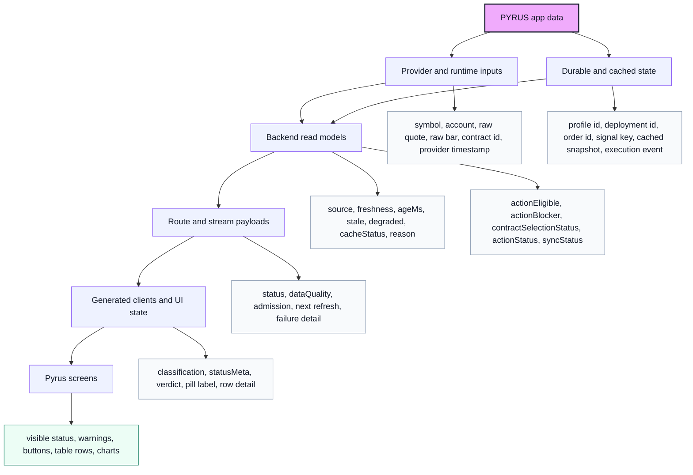

Property classes:

| Class | Examples | Rule |
|---|---|---|
| Identity | `symbol`, `accountId`, `profileId`, `deploymentId`, `providerContractId`, `signalKey`, `candidateId` | Identity fields define joins. Do not substitute display labels for join keys. |
| Trust and freshness | `source`, `marketDataMode`, `updatedAt`, `latestBarAt`, `latestSignalBarAt`, `ageMs`, `cacheStatus`, `stale`, `degraded`, `reason` | Preserve these through every mapper where the UI might imply data is live, cached, stale, or unavailable. |
| Actionability | `actionEligible`, `actionBlocker`, `contractSelectionStatus`, `actionStatus`, `syncStatus`, `readiness`, route admission state | These fields decide whether the user can act. Missing actionability is a backend data defect, not a copywriting problem. |
| Value payload | quotes, bars, greeks, spreads, chain contracts, balances, positions, order previews, backtest points | Values should not be displayed without enough identity and trust properties to explain what they are. |
| Diagnostics | pressure, backoff, lane capacity, route timeout, provider failure, bridge demand state, scan reason | Diagnostics are user-facing when they explain missing market data, blocked orders, or deferred automation. |
| UI-derived | `classification`, `statusMeta`, `verdict`, freshness line, row detail text | UI-derived fields may compress backend state, but must not invent a healthier state than the payload supports. |

## Signal Monitor Event History Contract

`/signal-monitor/events` is the durable signal-history read path for STA and the Signal Monitor screens. It returns events ordered by `signalAt desc, id desc`; `limit` is only a page size, bounded for response safety, and clients that need full history must pass the returned opaque `nextCursor` while `hasMore` is true. `from` and `to` bound `signalAt`, not `emittedAt`, because STA is answering "which signals happened during this market day?" rather than "when did the worker write the row?" The STA page asks for a rolling 36-hour window, then the row builder filters to the current New York market date and overlays current Signal Options action rows by signal key.

If `/signal-monitor/events` is unexpectedly empty, immediately sample `/signal-monitor/profile`, `/signal-monitor/state`, storage health, and diagnostics. A `runtime-fallback-*` profile or `"Postgres is unavailable; using runtime-only signal monitor evaluation."` means the route is in degraded runtime fallback/backoff; this is not proof that no events exist. The observed recovery path on 2026-06-04 was: storage health OK, Signal Monitor profile returned to the real persisted profile after backoff, `/signal-monitor/events` returned 515 rows in the 36-hour window, and the STA browser guard saw 248 same-day API events / 249 visible rows.

## Signal Options Property Flow

This is the current high-risk path because it joins monitor signals with automation candidates and option-contract selection. The signal row should be a final renderer of backend state, not the place where contract-selection truth is invented.

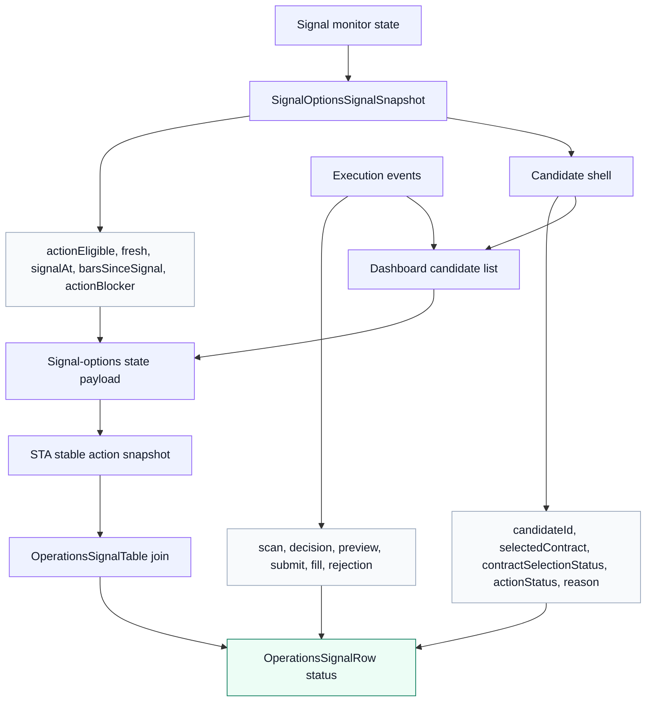

Signal-options handling rules:

1. An actionable signal must have a candidate shell, even on cache-only or fast summary paths.
2. `Monitor only` is valid only for non-actionable monitor rows. It is not a valid fallback for an actionable signal whose candidate is missing.
3. Contract discovery state belongs in backend candidate properties: `contractSelectionStatus`, `contractSelectionReason`, `selectedContract`, chain diagnostics, quote demand, and backoff.
4. UI status text should be a projection of those properties: `Contract pending`, `Action deferred`, `Blocked`, `Priced`, or `Candidate missing`.
5. A missing candidate for `actionEligible: true` is errant/blocker data and should be surfaced as such until the backend payload is fixed.
6. STA chooses one action source as a unit, not per-array. `AlgoScreen` resolves the best Signal Options cockpit/state snapshot with `resolveStableStaActionSnapshot`; if the current action source errors and would shrink the table, the UI keeps the last successful action snapshot and marks `sourceHealth.stale/degraded`.
7. STA matrix bubbles are Signal Monitor data requested by the visible STA surfaces. `OperationsSignalTable` and `PlatformAlgoMonitorSidebar` send foreground hydration with `clientRole: "algo-sta"` and `requestOrigin: "sta-visible-page"`; `PlatformApp` preserves those fields and treats route-active or surface-originated Matrix requests as foreground.
8. Foreground signal matrix refresh is a protected exact-cell class. Massive-backed Matrix profile/automatic evaluation covers 500 symbols at 10 concurrency, exact-cell and foreground/STA exact-cell requests cover 240 cells across pressure states, and frontend active/STA request coverage stays at 500 symbols/240 cells. If the server rejects a too-large exact-cell request, `app.ts` must return problem JSON with `data.maxCells` so the frontend can retry at the real cap instead of inventing pressure.
9. Signal Monitor event keys are built from `signalBarAt`, the signal bar anchor. User-facing STA signal time comes from the stored event `signalAt`, so stored-state and Signal Options fast paths must restore `signalAt` by event-key lookup before rendering rows.
10. STA sparklines are owned by row-level sparkline hydration once populated. Runtime quote/watchlist refreshes may update price and move inputs, but absent sparkline bars must not clear existing `sparkBars`.
11. Matrix cell pickup should happen immediately after each candle close. The scheduler should not wait for a 2x timeframe stale window, active Signals/STA matrix polling should use the foreground display cadence instead of the backend profile poll interval, and matrix evaluations should prefer live-edge Massive aggregate stream/cache bars while fast-returning complete stored rows. Cold or missing exact cells may source-fill/backfill, and the stream evaluator may use provisional live edge plus historical fallback; stored rows remain the preservation path when source is cold or unavailable.
12. Action Cockpit signal-stage detail is a backend state projection, not a dump of worker internals. `lastBatchSize: 0` with a positive universe means no monitor refresh symbols were evaluated in that worker pass, often because stored signal state was current or stream-first/runtime state was used. Do not render this as `last batch 0/N symbols`; render stored/current signal state or a non-empty `last refresh N/N symbols` progress line.

## Debug Waterfalls

Use these when debugging where a property fell out of the payload. Read each waterfall top to bottom. Each stage should either preserve the prior stage's identity/trust/actionability fields or replace them with an explicit reason.

### Route Payload

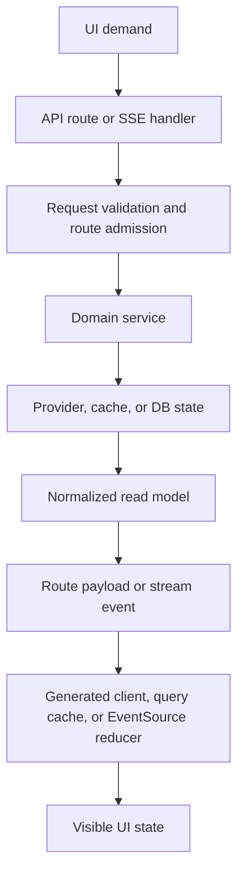

### Property Projection

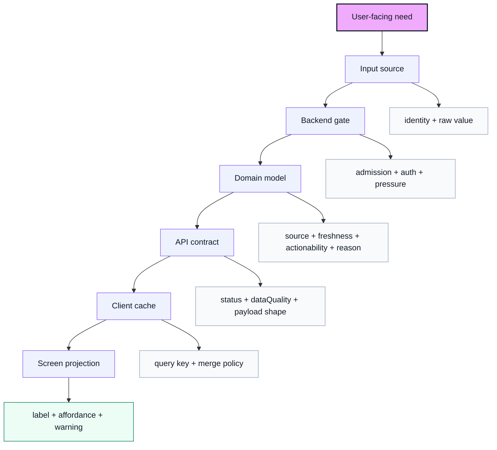

### Signal Options

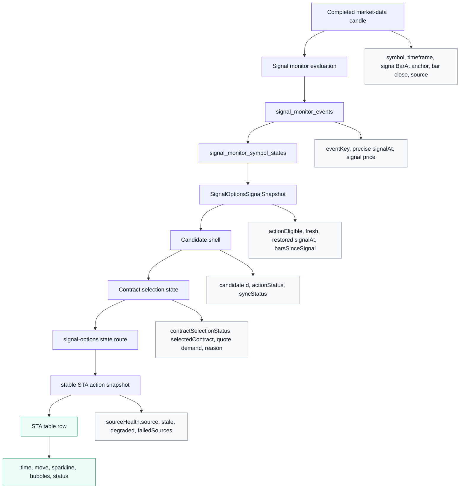

### Live Market Data

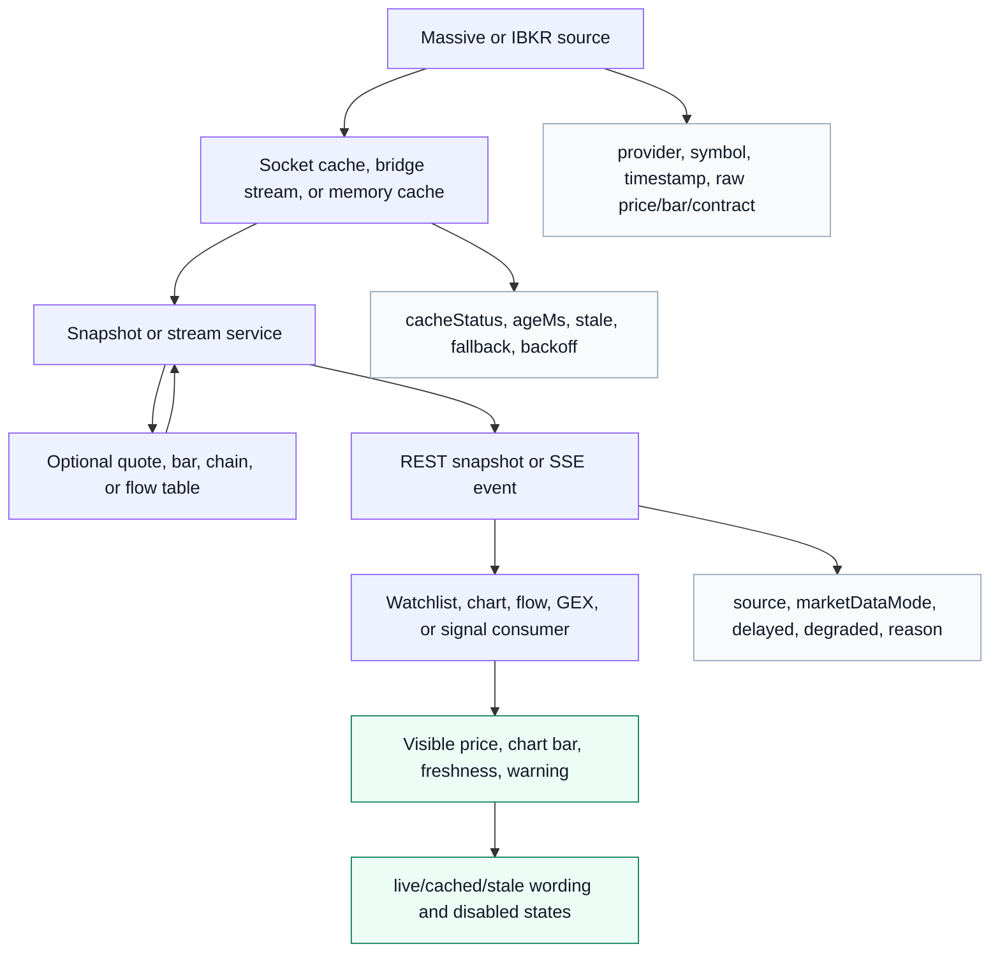

### Order And Execution

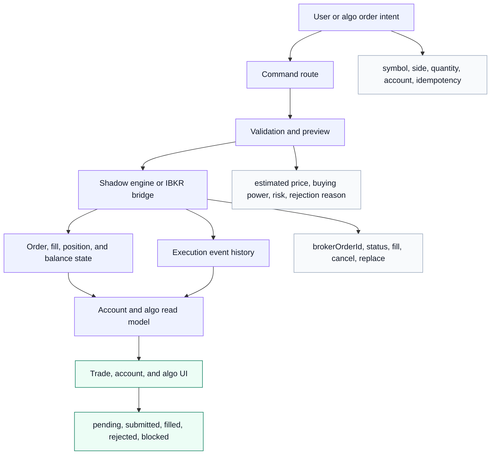

### Backtest Run

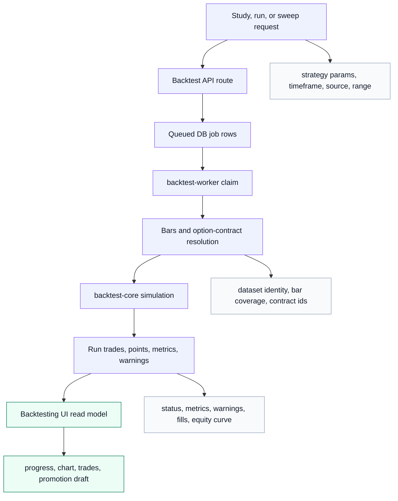

## Data Inventory

| Data family | Sources | Backend purpose | Owners | Storage/cache | Transmission | Main consumers | Handling rules |
|---|---|---|---|---|---|---|---|
| Runtime, readiness, settings | env, bridge runtime, DB, backend settings file, bridge override JSON | Tell UI what is available and govern backend behavior | `routes/readiness.ts`, `routes/settings.ts`, `services/readiness.ts`, `services/backend-settings.ts`, `services/ibkr-bridge-runtime.ts`, `services/user-preferences.ts` | backend settings file from `PYRUS_BACKEND_SETTINGS_FILE` or temp, DB preferences with temp-file fallback, watchlists, runtime maps/listeners | REST JSON, some SSE for line usage | header/status clusters, settings surfaces | Do not mutate Replit control-plane state during routine work. Settings route also aggregates watchlists, signal monitor, research status, Pine scripts, and algos. Settings/readiness should stay cheap unless a route intentionally probes upstreams. |
| Diagnostics and pressure | API metrics, browser reports, storage health, bridge health, client events, threshold overrides | Operator visibility, incident history, stream health, request pressure | `routes/diagnostics.ts`, `services/diagnostics.ts`, `services/request-metrics.ts`, `services/resource-pressure.ts` | diagnostic snapshots/events/threshold override tables, memory event buffers | REST JSON, export, `text/event-stream` | diagnostics panels, footer/header status, QA | Browser/client payloads are untrusted. Persist only intended event shapes. Pressure labels must name the actual driver. |
| Broker connectivity | remote desktop jobs, launcher bundle, bridge attach/detach, bridge session | Connect local/remote IBKR bridge and expose broker readiness | `routes/platform.ts`, `services/ibkr-bridge-runtime.ts`, `artifacts/ibkr-bridge/src/app.ts` | runtime maps, `data/ibkr-remote-desktops.json`, bridge override JSON | API REST, bridge REST, bridge SSE | IBKR connection UI, bridge launcher flow | Bridge API requires bearer auth only when token/require-auth config is set. Tokens/secrets are hashed or treated as sensitive. Avoid logging activation envelopes or login material. |
| Accounts and portfolio | IBKR bridge, Flex reports, shadow account engine, DB snapshots | Account summaries, positions, orders, fills, closed trades, risk, cash activity | `services/account.ts`, `services/account-page-streams.ts`, `services/shadow-account.ts`, `services/account-risk*.ts` | broker/account/trading tables, shadow tables, memory read caches | REST JSON, account/page SSE, shadow SSE | account panels, portfolio pulse, header strips, risk UI | Broker data is sensitive. Prefer explicit account IDs. Use cached snapshots for UI speed but keep source attribution visible. Shadow `Stocks`/`Options` position filters should reuse the all-positions cache for the same source/live-quote mode instead of independently rebuilding ledger rows. |
| Orders and executions | UI order intents, shadow order engine, IBKR bridge | Preview, submit, replace, cancel, monitor order and fill lifecycle | `routes/platform.ts`, `services/option-order-intent.ts`, `services/bridge-order-read-state.ts`, `services/overnight-spot-execution.ts`, bridge order routes | order request, broker order, execution fill, shadow order/fill tables | REST commands, orders/executions SSE | trade controls, algo monitor, account orders | Order paths are high-risk. Validate inputs at API boundary, keep idempotency/state checks explicit, and never hide broker rejection details behind generic UI state. |
| Stock quotes and aggregates | Massive stock sockets, provider REST where route explicitly permits, IBKR bridge snapshots/streams, memory caches | Live quotes, watchlist/header data, chart updates, scanner inputs | `services/platform.ts`, `services/massive-stock-websocket.ts`, `services/massive-stock-quote-stream.ts`, `services/massive-stock-aggregate-stream.ts`, `services/bridge-quote-stream.ts` | quote cache table, memory stream caches, inflight maps | REST snapshot, quote SSE, stock aggregate SSE | watchlists, header KPIs, charting hooks, market grids | Realtime stock quote and aggregate paths should use Massive socket caches where available with no artificial frontend/broad-universe cap; display/search limits are UI-only. Massive stock-universe quote/aggregate stream fanout should cover the effective universe, REST remains valid for historical/backfill and route-documented fallback paths only, and Signal Monitor Matrix evaluation is a separate Massive-backed consumer of aggregate live edge plus stored Matrix state. SSE emits `ready` before expensive initial work in guarded paths. |
| Bars and chart candles | Massive live aggregate sockets, Massive/IBKR historical bars, DB bar cache, worker/API synthesis | Historical and live chart bars, backtest datasets, derived timeframes, signal monitor completed bars | `services/platform.ts`, `services/market-data-store.ts`, `services/signal-monitor.ts`, `artifacts/ibkr-bridge/src/app.ts`, `artifacts/backtest-worker/src/index.ts` | `bar_cache`, completed-bar cache, market-data ingest jobs, provider request log, historical bar datasets/bars, memory route cache | REST `/bars`, bar SSE, stock aggregate SSE | chart surface, backtesting, signal monitor | Timeframe, symbol, source, and asset class define cache identity. `/bars` is a chart/backtest/historical surface, not the Signal Monitor live pickup trigger. Signal-monitor Matrix refresh is live-edge first, fast-returns complete stored rows, and may source-fill/backfill cold missing exact cells while preserving stored rows when source is cold. Stale `/bars` hits can serve immediately, but high pressure gates background refresh to active priority (`>= 8`) and critical suppresses stale-hit refreshes. |
| Options chains and quotes | IBKR bridge, Massive/other provider data where implemented, option metadata store | Contract discovery, chain display, quote/spread/greeks hydration, signal-options decisions | `services/platform.ts`, `services/option-metadata-store.ts`, `services/bridge-option-quote-stream.ts`, `artifacts/ibkr-bridge/src/app.ts` | instruments, option contracts, option chain snapshots, memory backoff/cache | REST chains/quotes, options quote SSE, bridge SSE | options panels, GEX, flow, signal-options, chart overlays | Separate metadata selection from live quote hydration. Provider contract IDs are required before IBKR option live lines can open. Respect lane budgets/backoff. |
| GEX, flow, footprints, market depth | Options chains/quotes, historical flow events, Massive/IBKR market data | Dealer exposure, flow tape, premium distribution, flow scanner views | `services/gex.ts`, `services/gex-projection.ts`, `services/historical-flow-events.ts`, `services/options-flow-scanner.ts`, `services/volume-footprints.ts` | GEX/flow summary tables, flow events, universe rankings, memory caches | REST JSON, selected SSE streams | GEX panels, flow scanner, chart event overlays | Flow and GEX mix computed and provider data. Keep source basis and freshness visible; stale/cached events must not look live. |
| Universe and reference data | Nasdaq directory, SP500 constituents, FMP, logo proxy, provider symbol lookup | Searchable ticker universe, logos, optionability, scanner planning | `services/universe-search*`, `services/nasdaq-symbol-directory.ts`, `services/sp500-constituents.ts`, `services/flow-universe*.ts` | universe catalog tables, ticker reference cache, memory caches | REST JSON/image proxy | ticker search, watchlists, flow universe, charts | Normalize symbols early. Logo proxy must constrain upstream targets and content type. Optionability rankings are derived, not broker truth. |
| Research | FMP enrichment, quote snapshots, and other research/provider endpoints | Fundamentals, financials, snapshots, earnings, filings, transcripts | `routes/research.ts`, `services/research.ts`, `providers/fmp/client.ts` | mostly provider-backed cache/service state; research snapshots merge provider enrichment and quotes at response time unless a service explicitly persists an artifact | REST JSON | research panels, chart sidebars | Third-party responses are untrusted. Keep provider failures distinguishable from no-data responses. |
| Signal monitor | Bars, indicators, profile settings, DB state, matrix hydration requests | Evaluate profiles, interval matrices, symbol states, signal events | `routes/signal-monitor.ts`, `services/signal-monitor.ts`, `services/trade-monitor-worker.ts` | signal monitor profiles/events/states, matrix cells, completed-bar caches, inflight maps | REST JSON | signals table/matrix, chart markers, header signal tape, algo automation/sidebar | Cache keys include profile, symbol, timeframe, evaluation mode, source strategy, and exact-cell identity. Primary state/events use the active profile timeframe; interval matrix states are separate and do not automatically become `signal_monitor_events`. Clean current/stale Matrix cells may persist every timeframe with preservation of newer/better stored activity. Event identity uses `signalBarAt`; display/restored time uses event `signalAt`. Exact-cell intent (`clientRole`, `requestOrigin`) controls foreground routing and flat Matrix caps; no-cell automatic Matrix requests are stored-state bootstrap reads for broad startup coverage. |
| Automation and algo | Signal monitor, options quotes, account state, user deployment settings | Deploy, pause, scan, backfill, execute paper/live strategy events | `routes/automation.ts`, `services/automation.ts`, `services/signal-options-automation.ts`, `services/overnight-spot-automation.ts`, worker state modules | algo strategies/deployments/runs, execution events, runtime maps | REST JSON, cockpit SSE | algo page/sidebar/cockpit, toasts, account/shadow views | Execution event history is the durable narrative. Distinguish scan, decision, preview, submit, fill, and rejection states. The Algo page STA table and sidebar share the same stable action snapshot plus Signal Monitor event merge; a mismatch is not expected product behavior. |
| Backtests | UI requests, API bars, option resolution, DB study/job rows, worker compute | Strategy studies, runs, sweeps, promotion drafts | `routes/backtesting.ts`, `services/backtesting.ts`, `artifacts/backtest-worker/src/index.ts`, `lib/backtest-core` | backtesting tables, historical bar datasets/bars, run trades/points | REST JSON, DB worker polling, worker fetch to API | backtesting panels, charts, draft promotion | Worker owns persisted run outputs. API creates jobs and read models. Keep historical dataset identity explicit. |
| Charting, watchlists, preferences | UI edits, local Pine seeds, DB rows | Save watchlists, Pine scripts, user preferences and chart-facing metadata | `routes/charting.ts`, `routes/settings.ts`, `services/pine-scripts.ts`, `services/user-preferences.ts`, watchlist services in platform | pine scripts, watchlists/items with DB-backoff fallback, user preference profiles with temp-file fallback | REST JSON via generated client | platform watchlist, chart settings, Pine menus | User-auth is not modeled here as multi-user auth. Treat profile IDs and watchlist IDs as current-app state, not global identity guarantees. |
| Marketing snapshot | local fixture/feed and optional stream token | Public/marketing dashboard snapshot and stream | `routes/marketing.ts`, `services/marketing-shadow-dashboard.ts` | local JSON fixture/feed, memory interval | REST JSON, protected SSE | marketing dashboard | Uses bearer token when configured. Keep separate from broker/account private surfaces. |

## Transmission Rules

| Transport | Where defined | Use it for | Rules |
|---|---|---|---|
| REST JSON under `/api` | `app.ts`, `routes/*`, `openapi.yaml` | request/response reads, commands, generated React Query hooks | Public contract belongs in `openapi.yaml`; generated clients come from Orval. Validate request boundaries and provider responses. |
| `application/problem+json` | `artifacts/api-server/src/app.ts` | API error responses | Zod errors currently become 400 invalid-request. `HttpError` becomes upstream problem response. Unknown errors become 500 without leaking internals. |
| API SSE | `routes/platform.ts`, `routes/diagnostics.ts`, `routes/marketing.ts`, stream services | quotes, bars, options, accounts, orders, executions, diagnostics, cockpit | Emit readiness/status events early where expected. Use heartbeat/error events. Close on request abort. Track stream opens/closes for diagnostics. |
| Bridge REST/SSE | `artifacts/ibkr-bridge/src/app.ts` | local TWS data, orders, bars, option chains, quotes, bridge diagnostics | Bridge may require bearer auth. Capacity/backpressure errors must remain visible. SSE batches quote events and reports stream status. |
| Worker DB polling | `artifacts/backtest-worker/src/index.ts` | backtest study jobs/runs/sweeps | API creates jobs and rows; worker claims/stales/retries jobs, fetches bars from API, and writes run outputs. |
| Generated clients | `lib/api-client-react`, `lib/api-zod` | React Query hooks, generated schema types, route request/response validation | Do not edit generated files directly. If OpenAPI changes, run the repo codegen/audit flow. Route modules import `@workspace/api-zod`; SSE consumers may use direct `EventSource` instead of generated hooks. |

## Persistence Map

```mermaid
erDiagram
  BROKER_CONNECTIONS ||--o{ BROKER_ACCOUNTS : has
  BROKER_ACCOUNTS ||--o{ BALANCE_SNAPSHOTS : records
  BROKER_ACCOUNTS ||--o{ ORDER_REQUESTS : receives
  BROKER_ACCOUNTS ||--o{ POSITION_LOTS : holds
  INSTRUMENTS ||--o{ ORDER_REQUESTS : targets
  INSTRUMENTS ||--o{ POSITION_LOTS : tracks
  OPTION_CONTRACTS ||--o{ ORDER_REQUESTS : optional_contract
  ORDER_REQUESTS ||--o{ BROKER_ORDERS : creates
  BROKER_ORDERS ||--o{ EXECUTION_FILLS : fills
  SHADOW_ACCOUNTS ||--o{ SHADOW_ORDERS : places
  SHADOW_ORDERS ||--o{ SHADOW_FILLS : fills
  SHADOW_ACCOUNTS ||--o{ SHADOW_POSITIONS : holds
  SHADOW_POSITIONS ||--o{ SHADOW_POSITION_MARKS : marks
  SHADOW_ACCOUNTS ||--o{ SHADOW_BALANCE_SNAPSHOTS : records
  SHADOW_ACCOUNTS ||--o{ SHADOW_PORTFOLIO_ANALYSIS_SNAPSHOTS : analyzes

  INSTRUMENTS ||--o{ OPTION_CONTRACTS : underlies
  INSTRUMENTS ||--o{ INSTRUMENT_ALIASES : aliases
  OPTION_CONTRACTS ||--o{ OPTION_CHAIN_SNAPSHOTS : snapshots
  INSTRUMENTS ||--o{ QUOTE_CACHE : quotes
  INSTRUMENTS ||--o{ BAR_CACHE : bars

  INSTRUMENTS ||--o{ FLOW_EVENTS : optional_symbol_ref
  OPTION_CONTRACTS ||--o{ FLOW_EVENTS : optional_contract_ref
  INSTRUMENTS ||--o{ ALERT_RULES : optional_symbol_ref
  ALERT_RULES ||--o{ ALERT_EVENTS : emits
  WATCHLISTS ||--o{ SIGNAL_MONITOR_PROFILES : scopes
  SIGNAL_MONITOR_PROFILES ||--o{ SIGNAL_MONITOR_SYMBOL_STATES : tracks
  SIGNAL_MONITOR_PROFILES ||--o{ SIGNAL_MONITOR_EVENTS : emits

  ALGO_STRATEGIES ||--o{ ALGO_DEPLOYMENTS : deploys
  ALGO_STRATEGIES ||--o{ ALGO_RUNS : runs
  ALGO_DEPLOYMENTS ||--o{ EXECUTION_EVENTS : narrates
  ALGO_RUNS ||--o{ EXECUTION_EVENTS : narrates
  WATCHLISTS ||--o{ BACKTEST_STUDIES : scopes
  BACKTEST_STUDIES ||--o{ BACKTEST_RUNS : runs
  BACKTEST_STUDIES ||--o{ BACKTEST_SWEEPS : sweeps
  BACKTEST_STUDIES ||--o{ BACKTEST_PROMOTIONS : promotes
  BACKTEST_RUNS ||--o{ BACKTEST_RUN_TRADES : trades
  BACKTEST_RUNS ||--o{ BACKTEST_RUN_POINTS : equity_curve
  BACKTEST_RUNS ||--o{ BACKTEST_PROMOTIONS : promotes
  ALGO_STRATEGIES ||--o{ BACKTEST_PROMOTIONS : receives
  HISTORICAL_BAR_DATASETS ||--o{ HISTORICAL_BARS : contains
  BACKTEST_RUNS ||--o{ BACKTEST_RUN_DATASETS : binds

  WATCHLISTS ||--o{ WATCHLIST_ITEMS : contains
  INSTRUMENTS ||--o{ WATCHLIST_ITEMS : tracks
```

Notes:

- The relationship arrows above are FK-backed or schema-backed relationships in the current app. Do not infer FK edges from domain adjacency alone.
- Standalone/correlated tables include `flow_event_hydration_sessions`, `flow_universe_rankings`, `universe_catalog_listings`, `market_data_ingest_jobs`, `provider_request_log`, `gex_snapshots`, `flow_summaries`, `user_preference_profiles`, `pine_scripts`, `diagnostic_snapshots`, `diagnostic_events`, and `diagnostic_threshold_overrides`. These correlate by provider, symbol, account, date/window, or application state rather than direct DB FKs.

## Critical Flow: Live Market Data

```mermaid
sequenceDiagram
  participant UI as Pyrus UI
  participant API as API /api streams
  participant SVC as Market data services
  participant MASS as Massive socket/provider
  participant BR as IBKR bridge
  participant DB as Drizzle/Postgres

  UI->>API: EventSource /api/streams/{quotes,bars,options}
  API-->>UI: ready / stream-status
  API->>SVC: subscribe or snapshot request
  alt Stock quote or aggregate path
    SVC->>MASS: shared WebSocket demand; REST only for explicit historical/backfill/fallback contracts
    MASS-->>SVC: quote/aggregate ticks
  else IBKR bars/options/broker path
    SVC->>BR: bridge REST/SSE with lane policy
    BR-->>SVC: snapshot, bar, quote, status, or capacity error
  end
  SVC->>DB: optional quote/bar/chain/flow cache write
  SVC-->>API: normalized payload with source/freshness
  API-->>UI: quotes, bars, chains, error, heartbeat
```

Handling notes:

- `ready` means stream setup happened, not that all upstream data is fresh.
- Source/freshness fields are part of user trust. Preserve them through service and UI mapping.
- Capacity, pacing, backpressure, and stale-stream states should be explicit. Do not collapse them into generic offline.
- In-memory stream caches are volatile. Durable replay requires a table-backed path.

## Critical Flow: Backtest Run

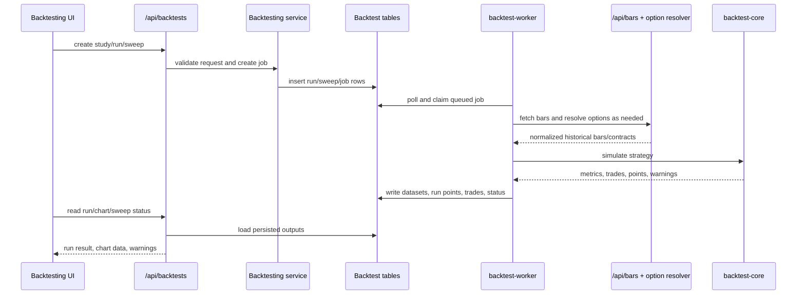

Handling notes:

- Backtest worker owns persisted run outputs after job claim.
- API route handlers own creating jobs and serving read models.
- Historical bar requests must include symbol, timeframe, range, source/asset class when relevant, and option provider contract ID when relevant.
- Warnings are data. Preserve and display them instead of silently accepting degraded fills or synthesized bars.

## Handling Rules For Agents

1. Validate at boundaries. API request bodies, query params, browser reports, bridge payloads, and provider responses are untrusted. Internal typed data can be trusted only after crossing a validated boundary.
2. Keep source attribution. Market data should carry provider/source/freshness where the UI depends on trust or actionability.
3. Separate metadata from live data. Option chain/contract discovery, live quote subscription, and computed greeks/spread/liquidity are separate states.
4. Respect admission and backoff. Route pressure, provider pacing, bridge lane capacity, and SSE drain timeouts are control signals, not incidental logs.
5. Do not edit generated clients. Update `openapi.yaml`, run codegen/audits, then consume generated outputs.
6. Do not make startup changes casually. `.replit`, artifact `artifact.toml`, dev scripts, DB startup config, and `scripts/reap-dev-port.mjs` require startup-maintenance intent and `pnpm run audit:replit-startup`.
7. Do not hide broker or order failures. User-facing trading surfaces need concrete reason codes and durable execution event history.
8. Keep caches honest. Name whether data is live, cached, fallback, synthesized, stale, or unavailable.
9. Treat account/order data as sensitive. Avoid logging tokens, activation envelopes, login material, raw account secrets, or unnecessary broker payloads.
10. Prefer domain-level changes. Route families, services, DB schemas, OpenAPI, generated clients, and UI consumers are coupled. Inspect all relevant boundaries before changing behavior.
11. Keep signal-monitor surfaces distinct. Active profile state/events drive "latest event" and header recent-signal pills; interval matrix hydration supplies the 1m/2m/5m/15m/1h/1d context. A fresh matrix-only interval will not appear as a primary recent event unless the UI/backend rule is intentionally changed, and Matrix persistence may update all timeframes only when it preserves newer/better stored profile activity.
12. Preserve STA row hydration. Signal times should be restored from `signal_monitor_events.signal_at` when stored state only has a bar-close timestamp, and runtime quote refreshes should not clear STA `sparkBars` unless a sparkline owner intentionally publishes replacement bars.
13. Keep signal-matrix pickup live-edge first. The matrix scheduler refreshes after candle close plus grace; active Signals/STA matrix polling uses foreground cadence instead of the evaluator profile poll interval; Signal Monitor matrix refresh uses Massive aggregate stream/cache first, fast-returns complete stored rows, starts browser sessions with a broad no-cells stored-state bootstrap when local Matrix persistence is incomplete, and may source-fill/backfill cold missing exact cells while preserving stored rows when source is cold.
14. Do not reintroduce artificial Massive/Matrix caps. Unknown server pressure stays normal on the active matrix path; backend Matrix profile/automatic evaluation uses 500 symbols at 10 concurrency, browser Matrix persistence preserves all 3000 cells for the 500x6 visible contract, foreground/STA exact cells use 240-cell admission caps, server cap rejections return structured `maxCells`, and only non-visible background hydration may pause under critical pressure.

## First Files To Inspect By Question

| Question | Start here |
|---|---|
| What endpoints exist? | `Exact API Surface Inventory` in this file; use `lib/api-spec/openapi.yaml` and `artifacts/api-server/src/routes` only to verify drift or inspect exact schemas/handlers. |
| Why is the UI slow or stale? | `services/request-metrics.ts`, `services/resource-pressure.ts`, `routes/diagnostics.ts`, relevant SSE route |
| Where does broker data enter? | `artifacts/ibkr-bridge/src/app.ts`, `services/ibkr-bridge-runtime.ts`, `providers/ibkr/bridge-client.ts` |
| Where are account rows built? | `services/account.ts`, `services/account-page-streams.ts`, `lib/db/src/schema/trading.ts`, `lib/db/src/schema/broker.ts` |
| Where are bars and quotes cached? | `services/market-data-store.ts`, `services/platform.ts`, `lib/db/src/schema/market-data.ts` |
| Why are option rows missing quotes/greeks? | `services/option-metadata-store.ts`, `services/bridge-option-quote-stream.ts`, `services/signal-options-automation.ts` |
| Why did an STA signal arrive late? | `signalMatrixScheduler.js`, `PlatformApp.jsx`, `services/signal-monitor.ts`, `services/massive-stock-aggregate-stream.ts`, `useMemoryPressureSignal.js` |
| Why is an STA signal time rounded to the timeframe close? | `services/signal-monitor.ts`, `services/signal-options-automation.ts`, `lib/db/src/schema/signal-monitor.ts`, `OperationsSignalRow.jsx` |
| Why did an STA sparkline disappear? | `runtimeTickerStore.js`, `PlatformApp.jsx`, `OperationsSignalTable.jsx`, `OperationsSignalRow.jsx`, charting sparkline hydration tests |
| Why is STA Move empty? | `algoHelpers.js`, `OperationsSignalRow.jsx`, `signal-options-automation.ts`, quote snapshot/runtime ticker paths |
| How do generated hooks map to endpoints? | `lib/api-client-react/src/generated/api.ts`, generated from `lib/api-spec/openapi.yaml` |
| How does a backtest finish? | `routes/backtesting.ts`, `services/backtesting.ts`, `artifacts/backtest-worker/src/index.ts` |
| Where are algo state and actions persisted? | `services/automation.ts`, `services/signal-options-automation.ts`, `lib/db/src/schema/automation.ts` |
| Which UI owns a consumer path? | `artifacts/pyrus/src/features/platform`, `features/charting`, `features/flow`, `features/gex`, `features/backtesting` |

## Maintenance Checklist

When changing backend data behavior:

- Update this map if a new provider, durable table, stream, generated endpoint, worker path, or major UI consumer is added.
- Keep diagrams inline in this Markdown file. Do not reintroduce sidecar SVG or companion Markdown diagram files.
- If route contracts change, update `lib/api-spec/openapi.yaml` and run `pnpm run audit:api-codegen`.
- If markdown links are added, run `pnpm run audit:markdown-paths`.
- If startup-sensitive files are touched, run `pnpm run audit:replit-startup`.
- For narrow docs-only edits like this file, `pnpm run audit:markdown-paths` is the expected validation.
